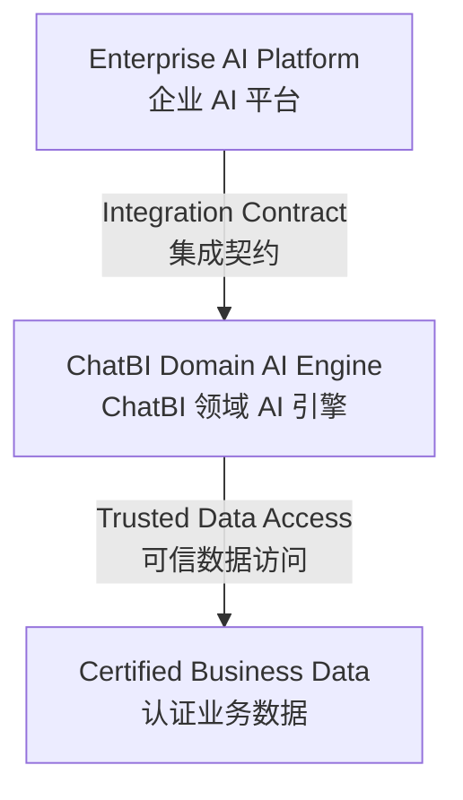
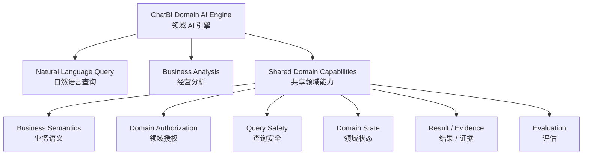
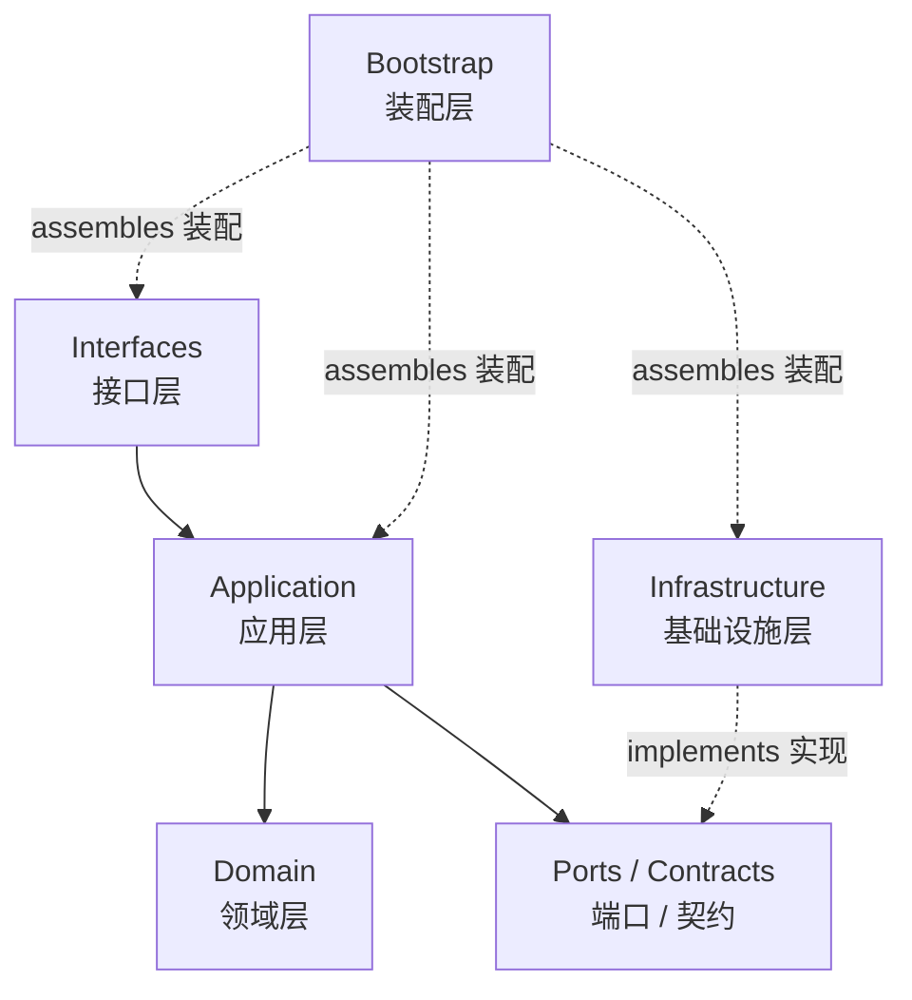

# ChatBI Architecture（系统架构）

> **Status（状态）**：Design Baseline（设计基线）  
> **Scope（范围）**：ChatBI 系统级架构  
> **Architecture Style（架构形态）**：Modular Monolith（模块化单体）  
> **Primary Capabilities（核心能力）**：Natural Language Query（自然语言查询）、Business Analysis（经营分析）

---

# 1. Purpose（文档目的）

本文档定义 ChatBI 的稳定 System Architecture（系统架构）。

主要定义：

- System Positioning（系统定位）
- System Boundary（系统边界）
- Responsibility Boundary（责任边界）
- Capability Boundary（能力边界）
- Integration Boundary（集成边界）
- Technical Layering（技术分层）
- Dependency Rules（依赖规则）
- Code Organization（代码组织）
- Architecture Invariants（架构不变量）

本文档回答：

> ChatBI 是什么？

> ChatBI 负责什么？

> ChatBI 不负责什么？

> ChatBI 内部如何分层？

> 各层之间允许如何依赖？

本文档不展开：

- Platform API（平台接口）字段和协议
- Feature Pipeline（功能流程）
- Module（模块）内部设计
- Class / Function（类 / 函数）
- Prompt（提示词）
- Retrieval / RAG（检索 / 检索增强）算法
- SQL 生成算法
- LangGraph（图工作流）节点
- 具体模型供应商
- 具体数据库产品
- 具体向量数据库产品
- Feature（功能）内部技术实现

这些内容分别由：

- Platform Integration Spec（平台集成规格）
- Feature Architecture（功能架构）
- Feature Spec（功能规格）
- Module Spec（模块规格）
- Implementation（实现）

负责定义。

工程开发方法由：

`ENGINEERING.md`

定义。

重要架构决策及其理由由：

`ARCHITECTURE_DECISIONS.md`

记录。

---

# 2. System Positioning（系统定位）

ChatBI 定位为：

> **Domain AI Engine（领域 AI 引擎）**

用于承载企业经营数据场景中的领域 AI 能力。

当前一级业务能力：

```text
ChatBI
├── Natural Language Query（自然语言查询）
└── Business Analysis（经营分析）
```

ChatBI 的核心职责：

> 将自然语言经营问题转换为可信、可追溯的数据结果，并基于可信数据完成经营分析。

ChatBI 不定位为：

> Enterprise AI Platform（企业 AI 平台）

---

## 2.1 System Context Diagram（系统上下文图）



稳定责任原则：

> **Platform（平台）负责企业通用能力。**

> **ChatBI 负责领域能力和领域正确性。**

---

# 3. System Form（系统形态）

ChatBI 当前采用：

> **Modular Monolith（模块化单体）**

系统保持：

```text
Single Repository（单代码仓库）

+

Single Application（单应用）

+

Single Deployment Unit（单部署单元）

+

Clear Internal Boundaries（清晰内部边界）
```

当前不提前拆分：

> Microservice（微服务）

服务拆分只有在出现真实需求时重新评估，例如：

- 独立部署需求
- 独立扩缩容需求
- 独立团队边界
- 独立故障隔离
- 明确性能瓶颈
- 明确容量瓶颈

原则：

> **先建立清晰模块边界，再根据真实需求决定是否服务化。**

---

# 4. Responsibility Boundary（责任边界）

系统责任边界：

```text
Enterprise AI Platform
        ↓
Generic Platform Capabilities
（通用平台能力）
        ↓
Integration Boundary
（集成边界）
        ↓
ChatBI Domain AI Engine
        ↓
Domain Capabilities
（领域能力）
```

---

## 4.1 Platform Owned（平台负责）

Enterprise AI Platform（企业 AI 平台）或企业基础设施负责通用平台能力。

### Identity（身份）

包括：

- Authentication（身份认证）
- 用户登录
- 用户目录
- 组织目录
- SSO（单点登录）
- Platform Permission（平台权限）

---

### Product Conversation（产品会话）

包括：

- Chat UI（聊天界面）
- Conversation（产品会话）
- Message History（消息历史）
- 产品级会话生命周期

---

### Model Platform（模型平台）

包括：

- Model Gateway（模型网关）
- 模型供应商接入
- API Key / Secret（密钥）
- 模型路由
- 模型配额
- 成本治理

---

### Platform Governance（平台治理）

包括：

- API Gateway（接口网关）
- Rate Limit（限流）
- Quota（配额）
- Platform Observability（平台可观测）
- Deployment（部署）
- Scaling（扩缩容）
- High Availability（高可用）
- Secret Management（密钥管理）
- Backup（备份）
- Disaster Recovery（灾难恢复）
- CI/CD（持续集成 / 持续交付）

以上能力不属于：

> ChatBI Core（ChatBI 核心）

---

# 5. ChatBI Owned（ChatBI 负责）

ChatBI 负责：

- Natural Language Query（自然语言查询）
- Business Analysis（经营分析）
- Shared Domain Capabilities（共享领域能力）

---

## 5.1 Capability Map（能力地图）



---

## 5.2 Natural Language Query（自然语言查询）

职责：

> 将自然语言经营问题转换为可信、可追溯的数据查询结果。

系统架构只定义该能力存在以及它的责任边界。

该 Feature（功能）可能涉及：

- Query Understanding（查询理解）
- Semantic Resolution（语义解析）
- Schema Linking（结构关联）
- Metric Retrieval（指标检索）
- Join Reasoning（关联推理）
- SQL Generation（SQL 生成）
- SQL Validation（SQL 校验）
- Query Safety（查询安全）
- Query Execution（查询执行）
- Clarification（澄清）
- Result Construction（结果构造）

具体执行链路由：

`Technical Design/Natural Language Query/`

中的 Feature Architecture（功能架构）与 Feature Spec（功能规格）定义。

---

## 5.3 Business Analysis（经营分析）

职责：

> 基于可信经营数据完成经营分析。

包括：

- Trend Analysis（趋势分析）
- Comparison（对比）
- Breakdown（拆解）
- Drill-down（下钻）
- Cause Validation（原因验证）
- Analysis Conclusion（分析结论）

稳定关系：

```text
Trusted Business Data
        ↓
Business Analysis
        ↓
Analysis Result
```

Business Analysis（经营分析）不得建立绕过 Trusted Query（可信查询）的独立数据访问链。

原则：

> **Trusted Data Before Analysis（可信数据先于分析）。**

---

# 6. Shared Domain Capabilities（共享领域能力）

---

## 6.1 Business Semantics（业务语义）

负责：

- Business Domain（业务领域）
- Business Object（业务对象）
- Metric（指标）
- Dimension（维度）
- Business Rule（业务规则）
- Business Meaning（业务含义）

业务事实由：

> Business Domain（业务领域）

定义。

稳定关系：

```text
Business Meaning
（业务含义）
        ↓
Stable
（稳定）

Technical Mapping
（技术映射）
        ↓
Replaceable
（可替换）
```

数据库字段、模型输出和检索结果不得反向决定业务事实。

---

## 6.2 Domain Authorization（领域授权）

必须区分：

```text
Authentication
（你是谁）

≠

Domain Authorization
（你能访问什么业务数据）
```

Platform（平台）负责：

> Authentication（身份认证）

ChatBI 根据领域规则决定：

- 可访问的 Business Domain（业务领域）
- 可访问的 Metric（指标）
- 可访问的 Dimension（维度）
- Data Scope（数据范围）
- Detail Access（明细权限）
- Sensitive Data Access（敏感数据权限）

流程：

```text
Platform Authentication
        ↓
Principal
        ↓
ChatBI Domain Authorization
        ↓
Authorized Data Scope
```

Platform Role（平台角色）可以作为授权输入。

但：

> Platform Role ≠ Final Data Scope

---

## 6.3 Query Safety（查询安全）

LLM（大语言模型）可以提出候选结果。

但 LLM 不能最终决定：

- Domain Authorization（领域授权）
- Data Scope（数据范围）
- Query Safety（查询安全）
- 最终数据执行边界

稳定关系：

```text
Model Candidate
        ↓
Deterministic Validation
（确定性校验）
        ↓
Allowed / Rejected
```

原则：

> **Model proposes, program decides.**

---

## 6.4 Domain State（领域状态）

必须区分：

```text
Product Conversation
（产品会话）

≠

Domain State
（领域状态）
```

Platform（平台）负责：

- Conversation（会话）
- Message History（消息历史）
- 产品级会话生命周期

ChatBI 负责完成业务任务所需要的领域状态。

例如：

- 上一轮成功查询语义
- 上一轮查询结果引用
- Pending Clarification（待澄清状态）
- 当前分析状态
- 当前业务上下文

具体保存什么状态：

> 由 Feature Spec（功能规格）决定。

系统架构不绑定具体：

> State Store（状态存储）

产品。

---

## 6.5 Result / Evidence（结果 / 证据）

稳定关系：

```text
Natural Language Query
        ↓
Query Result
        ↓
Evidence
        ↓
Business Analysis
        ↓
Analysis Result
```

ChatBI 负责：

- 结果业务含义
- 结果正确性
- 数据访问范围
- 必要追溯信息
- Evidence（证据）关系

Platform（平台）负责：

- 展示
- UI 交互
- 产品级消息呈现

---

## 6.6 Evaluation（评估）

ChatBI 负责：

- Query Evaluation（查询评估）
- Analysis Evaluation（分析评估）
- Business Correctness（业务正确性）
- Regression（回归）
- Bad Case（错误案例）

必须区分：

```text
Observability
（可观测性）

=
系统运行得怎么样
```

和：

```text
Evaluation
（评估）

=
业务结果做得对不对
```

平台 Observability（可观测性）不能替代 ChatBI 的业务 Evaluation（评估）。

---

# 7. Integration Boundary（集成边界）

正常情况下：

```text
Enterprise AI Platform
        ↓
ChatBI Public Contract
        ↓
ChatBI Interfaces
        ↓
ChatBI Core
```

如果外部 Platform（平台）与 ChatBI 存在真实语义或协议差异：

```text
External Platform
        ↓
Adapter / Anti-Corruption Layer
（适配器 / 防腐层）
        ↓
ChatBI Public Contract
        ↓
ChatBI Core
```

原则：

> **Contract Alignment First（优先契约统一）。**

> **Adapter When Required（必要时才使用适配器）。**

Platform Adapter（平台适配器）不是固定架构层。

---

# 8. External Capability Boundaries（外部能力边界）

ChatBI Core 通过稳定：

> Port / Contract（端口 / 契约）

使用外部能力。

主要外部能力包括：

- Platform Integration（平台集成）
- Model（模型）
- Business Data（业务数据）
- Retrieval（检索）
- State（状态）
- Telemetry（遥测）
- Audit（审计）
- Runtime（运行环境）

---

## 8.1 Platform Integration（平台集成）

Platform ↔ ChatBI 的正式集成语义与 API Contract（接口契约）由：

```text
Technical Design/
└── Platform Integration/
```

负责。

System Architecture（系统架构）只定义：

> Platform 与 ChatBI 存在稳定 Integration Boundary（集成边界）。

不定义接口字段。

---

## 8.2 Model Boundary（模型边界）

ChatBI Core 不直接绑定：

- OpenAI
- DeepSeek
- Qwen
- 某个 Model Gateway（模型网关）
- 某个模型供应商 SDK

具体模型接入由：

> Infrastructure（基础设施层）

实现。

---

## 8.3 Retrieval Boundary（检索边界）

业务逻辑不得直接绑定：

- 某个 Embedding Model（向量模型）
- 某个 Vector Database（向量数据库）
- 某个 Retrieval Framework（检索框架）

具体 Retrieval（检索）技术由：

> Infrastructure（基础设施层）

实现。

业务事实与技术索引必须保持分离：

```text
Business Source of Truth
（业务事实源）
        ↓
Stable

Retrieval Index
（检索索引）
        ↓
Derived / Replaceable
（派生 / 可替换）
```

---

## 8.4 Business Data Boundary（业务数据边界）

ChatBI 通过稳定：

> Data Access Contract（数据访问契约）

访问：

> Certified Business Data（认证业务数据）

ChatBI 不负责：

- ETL（数据抽取转换加载）
- 企业数据仓库建设
- 原始数据加工
- 企业数据调度平台

ChatBI 负责：

> 按照 Domain（领域）规则正确、安全地使用业务数据。

---

## 8.5 State / Telemetry / Audit / Runtime

ChatBI 只定义自身需要的能力和语义。

具体：

- State Store（状态存储）
- Observability Backend（可观测后端）
- Audit Backend（审计后端）
- Runtime Platform（运行平台）

可以替换。

ChatBI Core 不依赖具体产品。

---

# 9. Technical Layering（技术分层）

ChatBI 内部采用：

- Interfaces（接口层）
- Application（应用层）
- Domain（领域层）
- Infrastructure（基础设施层）
- Bootstrap（装配层）

---

## 9.1 Technical Layer Diagram（技术分层图）



---

## 9.2 Interfaces（接口层）

负责：

- 接收外部请求
- Protocol Translation（协议转换）
- 基础输入校验
- 调用 Application（应用层）
- 返回外部响应

不负责：

- 核心业务规则
- 完整 Feature Workflow（功能流程）

---

## 9.3 Application（应用层）

负责：

- Use Case（用例）
- Feature Workflow（功能流程）
- Orchestration（编排）
- 分支
- 状态流转
- 调用 Domain（领域层）
- 调用外部 Port / Contract（端口 / 契约）

Application 回答：

> 完成一个 Feature（功能）需要哪些能力？

Application 不回答：

> 某个供应商具体如何实现这些能力？

---

## 9.4 Domain（领域层）

负责：

- Business Object（业务对象）
- Metric（指标）
- Dimension（维度）
- Business Rule（业务规则）
- Domain Authorization（领域授权）
- Domain State Semantics（领域状态语义）
- Result Semantics（结果语义）
- 稳定领域模型

Domain 不依赖：

- LLM SDK
- Database SDK
- Vector Database SDK
- FastAPI
- LangGraph
- Redis
- Platform SDK
- 具体供应商

---

## 9.5 Infrastructure（基础设施层）

负责具体技术能力实现，例如：

- Model Adapter（模型适配器）
- Retrieval Adapter（检索适配器）
- Business Data Adapter（业务数据适配器）
- State Adapter（状态适配器）
- Database Access（数据库访问）
- Telemetry（遥测）
- Audit（审计）
- Platform Adapter（平台适配器，可选）

原则：

> Infrastructure 实现技术能力。

但：

> Infrastructure 不定义业务事实。

---

## 9.6 Bootstrap（装配层）

负责：

- Configuration（配置）
- Dependency Injection（依赖注入）
- Adapter Assembly（适配器装配）
- Application Startup（应用启动）

Bootstrap 不承载业务逻辑。

---

# 10. Dependency Rules（依赖规则）

稳定依赖：

```text
Interfaces
        ↓
Application
        ↓
Domain
```

外部能力：

```text
Application
        ↓
Ports / Contracts
        ↑
Infrastructure
```

必须保持：

1. Domain 不依赖 Infrastructure。
2. Domain 不依赖具体框架和供应商。
3. Application 不直接依赖供应商 SDK。
4. Application 通过 Port / Contract 使用外部能力。
5. Infrastructure 实现外部技术能力。
6. Interfaces 不绕过 Application 完成业务流程。
7. Infrastructure 不定义业务指标和业务规则。
8. Bootstrap 只负责装配。
9. Platform 私有对象不得穿透系统边界进入 ChatBI Core。
10. Feature 内部实现不得破坏系统级依赖方向。

---

# 11. Code Organization（代码组织）

运行代码顶层结构保持：

```text
src/
└── chatbi/
    ├── interfaces/
    ├── application/
    ├── domain/
    ├── infrastructure/
    └── bootstrap/

resources/

tests/

evaluation/

scripts/
```

职责：

```text
interfaces/
→ 外部入口

application/
→ Feature / Use Case / Orchestration

domain/
→ 业务规则与稳定领域模型

infrastructure/
→ 外部技术实现

bootstrap/
→ 配置与装配
```

系统级 Architecture（架构）不提前规定：

- Feature Package（功能包）
- Module（模块）
- File（文件）
- Class（类）
- Function（函数）

这些由下级设计逐步确定。

---

# 12. Architecture Invariants（架构不变量）

以下规则长期保持。

---

## 12.1 Business First（业务优先）

技术服务于业务。

不得因为某个框架或产品改变业务目标。

---

## 12.2 Domain Owns Business Truth（领域拥有业务事实）

业务含义由 Domain（领域）定义。

数据库、模型、向量库和检索结果不得反向定义业务事实。

---

## 12.3 Authentication ≠ Domain Authorization

Authentication（身份认证）

不等于：

Domain Authorization（领域授权）。

---

## 12.4 Product Conversation ≠ Domain State

Product Conversation（产品会话）

不等于：

Domain State（领域状态）。

---

## 12.5 Model Proposes, Program Decides

LLM（大语言模型）提出候选。

确定性程序负责最终业务和安全裁决。

---

## 12.6 Trusted Data Before Analysis

Business Analysis（经营分析）

必须建立在：

Trusted Business Data（可信业务数据）

之上。

---

## 12.7 Contract Alignment First

优先统一 Contract（契约）。

只有存在真实边界差异时，才增加：

Adapter / Anti-Corruption Layer（适配器 / 防腐层）。

---

## 12.8 Stable Core, Replaceable Edge（稳定核心，可替换边缘）

```text
Replace Platform
→ Keep ChatBI Core

Replace Model Provider
→ Keep Domain

Replace Database
→ Keep Business Semantics

Replace Retrieval
→ Keep Business Definition

Replace State Store
→ Keep Domain State Semantics
```

---

## 12.9 Do Not Overbuild（不过度建设）

Architecture（架构）定义系统边界。

不代表当前阶段必须一次性实现所有基础设施。

没有真实需求时，不提前建设：

- Microservice（微服务）
- 大量空 Interface（接口）
- 大量空 Adapter（适配器）
- Plugin Framework（插件框架）
- Distributed Runtime（分布式运行时）
- Enterprise IAM（企业身份管理）
- Complex State Platform（复杂状态平台）

---

# 13. Architecture Change Rule（架构变更规则）

以下变化需要重新评估本文件：

- System Positioning（系统定位）
- Platform / ChatBI Responsibility Boundary（责任边界）
- 一级 Business Capability（业务能力）
- Technical Layering（技术分层）
- Dependency Direction（依赖方向）
- 顶层 Code Organization（代码组织）
- Integration Boundary（集成边界）
- Architecture Invariant（架构不变量）

以下变化通常不修改本文件：

- 新增 Metric（指标）
- 新增 Dimension（维度）
- 修改 Prompt（提示词）
- 修改 Retrieval（检索）
- 更换模型
- 更换数据库
- 调整 Feature Pipeline（功能流程）
- 新增 Module（模块）
- 修改 Module Algorithm（模块算法）
- 修复 Bad Case（错误案例）
- 新增测试

前提：

> 所有变化仍遵守当前 Architecture（架构）定义的边界。

---

# 14. Related Documents（相关文档）

系统架构：

```text
ARCHITECTURE.md
```

回答：

> 系统是什么、如何组织。

工程方法：

```text
ENGINEERING.md
```

回答：

> 系统应该如何设计、开发、测试和演进。

架构决策：

```text
ARCHITECTURE_DECISIONS.md
```

回答：

> 为什么采用当前这些关键架构决定。

Feature（功能）与 Module（模块）详细设计继续向下展开。

---

# 15. Architecture Baseline（架构基线）

当前系统基线：

```text
Domain AI Engine
（领域 AI 引擎）

+

Modular Monolith
（模块化单体）

+

Natural Language Query
（自然语言查询）

+

Business Analysis
（经营分析）

+

Shared Domain Capabilities
（共享领域能力）
```

技术基线：

```text
Interfaces
        ↓
Application
        ↓
Domain

Application
        ↓
Ports / Contracts
        ↑
Infrastructure

Bootstrap
→ Assembly
```

核心原则：

> **Business First（业务优先）。**

> **Domain Owns Business Truth（领域拥有业务事实）。**

> **Model proposes, program decides.**

> **Trusted Data Before Analysis（可信数据先于分析）。**

> **Stable Core, Replaceable Edge（稳定核心，可替换边缘）。**