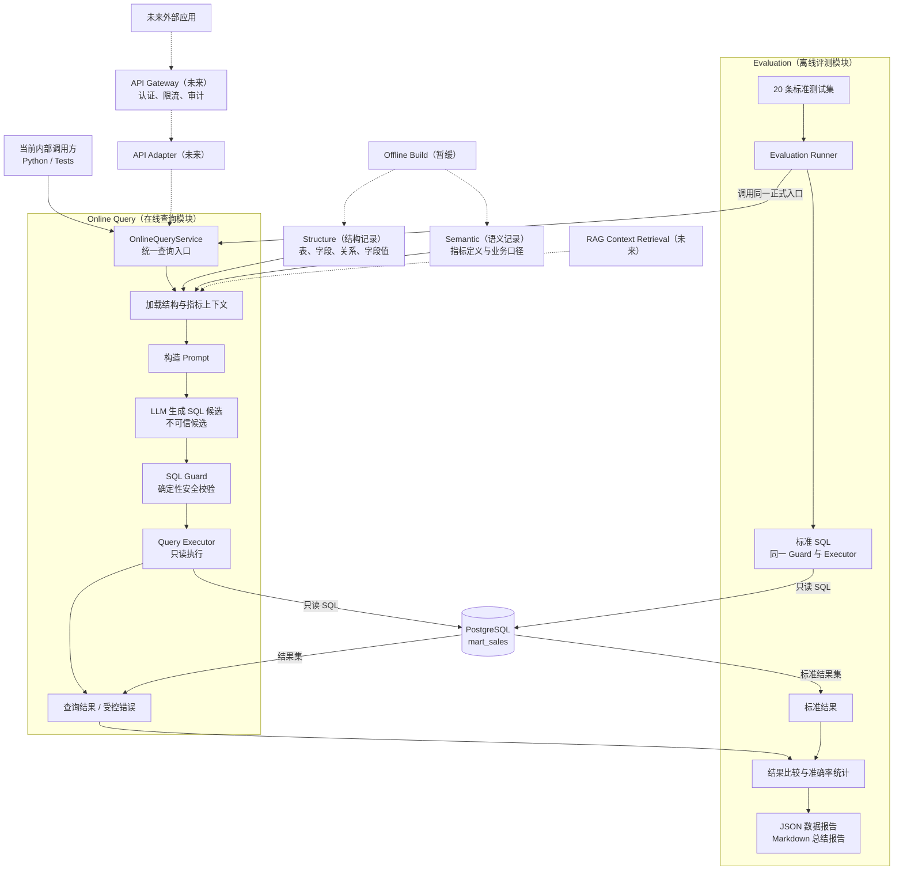

# ChatBI 架构

## 系统定位

ChatBI 是面向业务数据查询的 Domain AI Engine（领域 AI 引擎），当前采用 Modular Monolith（模块化单体）。先完成最小正确闭环，再根据真实需求扩展。

## 当前模块

### Online Query（在线查询）

负责把自然语言问题转换为安全 SQL、执行数据库查询并返回结果。这是当前第一个需要设计和实现的业务模块。

### Evaluation（评测）

负责使用标准测试集调用同一条 Online Query 链路，比较生成 SQL 与标准 SQL 的执行结果，并输出评测数据。它不参与用户在线请求。

## 全局结构



实线表示当前已经实现的能力，虚线表示未来边界。Evaluation 是离线模块，只复用正式 Online Query，不参与用户在线请求。

## 暂缓模块

### Offline Build（离线构建）

当前不建设正式 Offline Build 模块。项目已有：

- `scripts/metadata/export_schema.py`：能够从 PostgreSQL 导出表、字段和关系。
- `src/structure/generated/`：已生成的结构记录。
- `src/semantic/metrics.json`：人工维护的指标目录。

现有导出脚本没有覆盖 `column_values.json`、指标校验、统一发布和 RAG 索引，因此定位为辅助脚本，不视为完整业务模块。出现频繁结构变更或正式 RAG 构建需求后，再决定是否模块化。

## 在线主链路

```text
用户问题
  -> 加载结构和指标上下文
  -> 组装 Prompt
  -> LLM 生成 SQL 候选
  -> SQL Guard 提取并校验 SQL
  -> PostgreSQL 只读执行
  -> 返回查询结果或受控失败
```

节点属于 Online Query 模块内部，不自动等同于顶级模块。最终节点 Contract 和代码落位在 Online Query Module Spec 确认后进入 Implementation Design。

## 外部能力边界

- PostgreSQL：保存业务数据和物理结构事实。
- LLM：提出 SQL 候选，不决定业务真相、权限和安全。
- 静态知识文件：当前为 Online Query 提供结构和指标上下文。
- API Gateway：未来位于 ChatBI 外部边界，负责认证、限流、审计和流量治理；核心模块不绑定具体网关产品。

## 稳定约束

- Online Query 只能通过只读数据库身份访问 `mart_sales`。
- Evaluation 必须复用正式 Online Query 链路，不维护另一套 SQL 生成逻辑。
- RAG 未来只能替换上下文获取方式，不能改变指标事实和 SQL 安全边界。
- 网关接入不能把认证信息、平台 SDK 或流量治理逻辑写入核心业务链路。

## 当前状态

- 数据库、结构记录、指标目录和标准评测集已准备。
- 结构导出辅助脚本已存在。
- Online Query Module Spec 与 Implementation Design 已确认。
- Online Query 已实现，Software Test 与真实 PostgreSQL 集成测试已通过。
- Evaluation 已实现并复用正式 Online Query 链路；20 条真实 LLM 标准评测全部通过，JSON 数据报告和 Markdown 总结报告已提交。
- 旧版扁平 POC 链路及其重复测试已删除。
- 正式 Offline Build 模块尚未实现。
