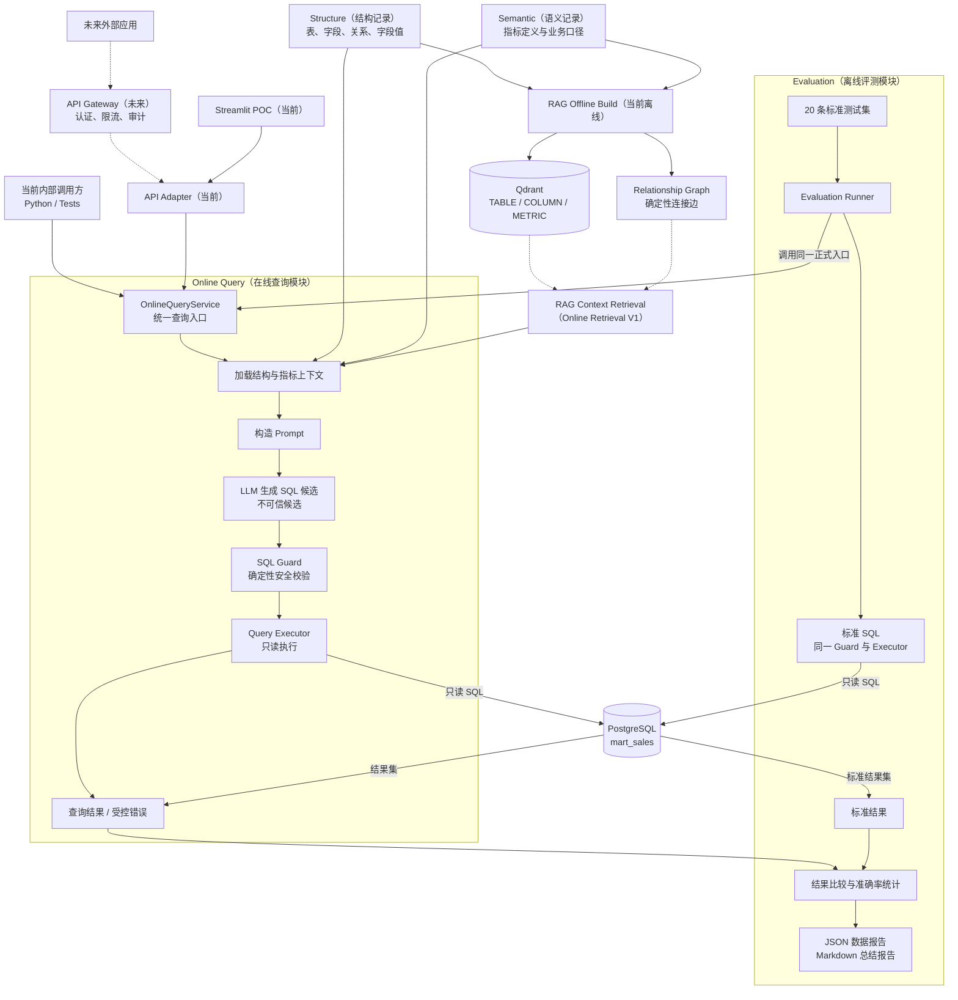
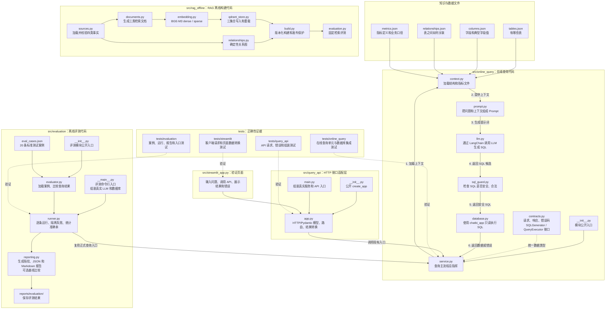
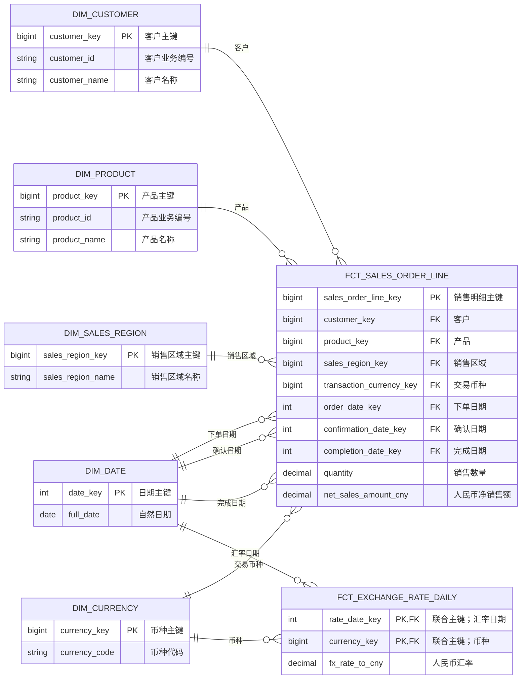

# ChatBI 架构

## 系统定位

ChatBI 是面向业务数据查询的 Domain AI Engine（领域 AI 引擎），当前采用 Modular Monolith（模块化单体）。先完成最小正确闭环，再根据真实需求扩展。

## 当前模块

### Online Query（在线查询）

负责把自然语言问题转换为安全 SQL、执行数据库查询并返回结果。这是当前第一个需要设计和实现的业务模块。

### Query API Adapter（查询接口适配层）

负责把 HTTP JSON 请求转换为现有 Online Query 请求，并把查询结果转换为 HTTP JSON 响应。它不重复 Prompt、LLM、SQL Guard 或数据库执行逻辑，也不负责认证、限流和审计。

### Streamlit（当前 POC / 内部入口）

负责通过 HTTP 调用 Query API Adapter，完成自然语言查询的输入、结果展示和错误提示。它是当前 POC 和内部使用入口，不直接连接 LLM 或数据库。正式前端不是当前必需项；生产化时可以按同一 HTTP API 契约替换页面。

### Evaluation（评测）

负责使用标准测试集调用同一条 Online Query 链路，比较生成 SQL 与标准 SQL 的执行结果，并输出评测数据。它不参与用户在线请求。

### RAG Offline Build（RAG 离线构建）

负责加载并校验表、字段、关系和指标事实，生成 TABLE、COLUMN、METRIC 三类检索文档，使用 BGE-M3 生成向量并写入三个独立 Qdrant 集合，同时交付确定性 Relationship Graph（关系图）。它是同步离线批处理，不参与用户在线请求，也不修改 PostgreSQL。

## 全局结构



实线表示当前已经实现的能力，虚线表示未来边界。Evaluation 和 RAG Offline Build 负责离线资产，Online Retrieval V1 已将 Qdrant 检索、关系图和上下文接入 Online Query。

## 代码地图

这张图用于快速定位“每个文件负责什么”以及主要运行顺序。



箭头表示主要运行顺序和依赖方向，不表示每个文件都直接调用下一个文件。

## 数据模型

这里的 Entity（实体）是数据库中需要保存的业务数据对象，不是代码里的 Class（类）。下图只保留理解业务关系所需的核心字段：

- `PK` = Primary Key（主键），唯一标识一条记录。
- `FK` = Foreign Key（外键），指向另一张表的主键。
- `dim_` = Dimension（维度），描述日期、客户、产品等业务对象。
- `fct_` = Fact（事实），记录销售明细、汇率等业务事实。



## 离线检索资产

RAG Offline Build 已实现：

- `scripts/metadata/export_schema.py` 仍只是结构导出辅助脚本，不等同于离线构建。
- `src/structure/generated/` 和 `src/semantic/metrics.json` 是权威输入。
- `src/rag_offline/` 负责校验事实、生成文档、向量化、写入 Qdrant、构建关系图和发布完整资产。
- `data/rag/current.json` 是当前发布指针，版本目录保存 manifest 和关系图。

Online Retrieval V1 已接入 Online Query：实体类和单指标问题默认使用已发布 RAG 资产组装动态上下文；可确定的技术故障仍可按基线规则回退静态上下文。基础 Multi-Metric Retrieval（多指标在线检索）已完成独立规格设计，尚未实现。

## 在线主链路

```text
用户问题
  -> 读取已发布 RAG 资产快照并执行 Online Retrieval
  -> 组装动态结构和指标上下文（基线技术故障时可静态 fallback）
  -> 组装 Prompt
  -> LLM 生成 SQL 候选
  -> SQL Guard 提取并校验 SQL
  -> PostgreSQL 只读执行
  -> 返回查询结果或受控失败
```

节点属于 Online Query 模块内部，不自动等同于顶级模块。最终节点 Contract 和代码落位在 Online Query Module Spec 确认后进入 Implementation Design。

通过 HTTP 调用时，先经过 Query API Adapter，再进入同一条 Online Query 主链路。

## 外部能力边界

- PostgreSQL：保存业务数据和物理结构事实。
- LLM：提出 SQL 候选，不决定业务真相、权限和安全。
- BGE-M3：只对离线检索文档正文和检索评测问题生成向量，不决定业务事实。
- Qdrant：保存版本化 TABLE、COLUMN、METRIC 检索集合，不保存业务真相。
- 已发布 RAG 资产：当前为 Online Query 默认提供动态结构和指标上下文；静态知识文件只作为实体类、单指标基线技术故障时的 fallback。
- Query API Adapter：当前提供同步 HTTP JSON 接口，只做协议转换。
- Streamlit：当前用于 POC 和内部使用，只通过 HTTP 调用 API；未来正式前端可以复用同一 API 契约。
- API Gateway：未来位于 ChatBI 外部边界，负责认证、限流、审计和流量治理；核心模块不绑定具体网关产品。

## 稳定约束

- Online Query 只能通过只读数据库身份访问 `mart_sales`。
- Query API Adapter 只能调用现有 Online Query 公开入口，不复制查询逻辑。
- Streamlit POC 只能调用 Query API，不直接访问 LLM、SQL Guard 或数据库。
- Evaluation 必须复用正式 Online Query 链路，不维护另一套 SQL 生成逻辑。
- RAG Offline Build 只能读取已确认 JSON 事实，不得扫描或修改 PostgreSQL。
- 只有三个集合和关系图全部重载校验通过后，才能替换当前发布指针。
- Online Retrieval 只能替换上下文获取方式，不能改变指标事实、授权边界和 SQL 安全边界。
- 网关接入不能把认证信息、平台 SDK 或流量治理逻辑写入核心业务链路。

## 当前状态

- 数据库、结构记录、指标目录和标准评测集已准备。
- 结构导出辅助脚本已存在。
- Online Query Module Spec 与 Implementation Design 已确认。
- Online Query 已实现，Software Test 与真实 PostgreSQL 集成测试已通过。
- Query API Adapter 已实现，提供 `/health` 和 `/api/v1/query`；API 确定性测试已通过。
- Streamlit 页面已实现，提供问题输入、结果展示和受控错误提示，并通过三条手工业务验收。
- Evaluation 已实现并复用正式 Online Query 链路；支持范围内 19/19 通过，另有 1 条多指标组合按 V1 边界受控返回 CANNOT_ANSWER，JSON 数据报告和 Markdown 总结报告已提交。
- 旧版扁平 POC 链路及其重复测试已删除。
- RAG Offline Build 已实现并发布 BGE-M3 / Qdrant 离线资产；TABLE=7、COLUMN=69、METRIC=5、关系边=9，固定检索评测 5/5 通过。
- Online Retrieval、Schema Linking 和关系图在线路径查找已完成 V1 实现，并已通过真实 Qdrant、LLM 和 PostgreSQL 端到端验收；多指标复杂组合仍属于后续边界。
- 正式前端 UI 不是当前下一步必做项，继续使用 Streamlit，待生产化需求明确后再决定。
