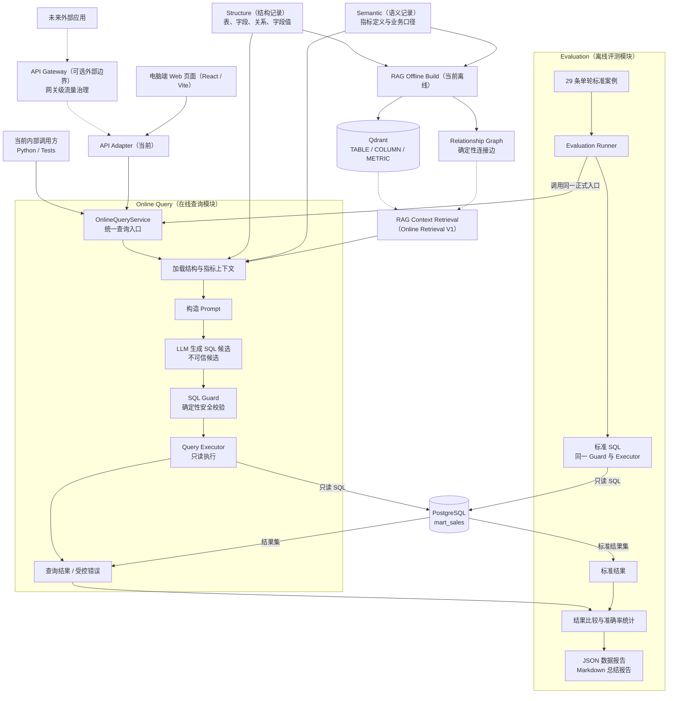
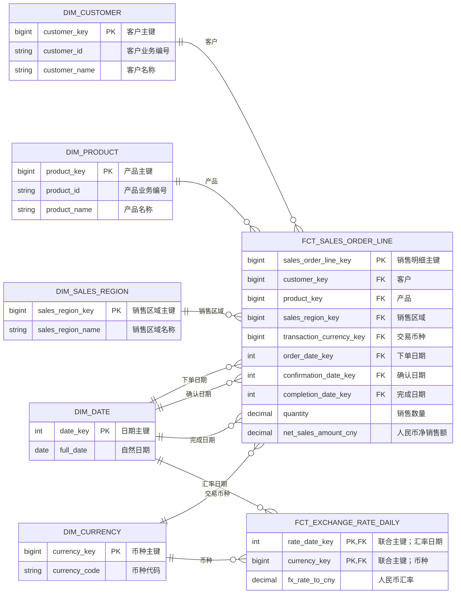

# ChatBI 架构

## 系统定位

ChatBI 是面向业务数据查询的 Domain AI Engine（领域 AI 引擎），当前采用 Modular Monolith（模块化单体）。先完成最小正确闭环，再根据真实需求扩展。

当前处于 MVP 向生产演进阶段。MVP 核心链路已实现；本地开发 / 内部验收证据不构成生产部署或运行保障证明。

## 当前模块

### Online Query（在线查询）

负责把自然语言问题转换为安全 SQL、执行数据库查询并返回结果，是当前 ChatBI 的核心查询模块。

### Query API Adapter（查询接口适配层）

负责 HTTP Contract、认证、授权、查询调用和响应转换；持久化账号、Session、RBAC 与安全审计由 `src/chatbi_control/`、`src/authorization/` 和 Admin Adapter 协作完成。它不重复 Prompt、LLM、SQL Guard 或数据库执行逻辑，也不提供限流。Multi-Turn Query V1 的短期会话状态由 API Application 边界负责，不由 Online Query 或客户端拥有。

### ChatBI Account & Admin（账号与管理）

`src/chatbi_control/` 维护账号、Session、固定 RBAC、审计和 Control DB Schema；`src/authorization/` 负责身份、授权策略和审计 Contract。业务查询数据库 `chatbi_mvp` 与 Control DB `chatbi_control` 使用不同运行账号。

### Multi-Turn Query V1（受控多轮查询）

这是建立在 Query API 之上的已实现 Application 能力，不是第二条查询链路：

- 只保存最后一次成功查询的结构化状态，不保存原始对话、SQL 或结果行；
- 每一轮先使用当前认证身份和授权策略，再进入现有 `AuthorizedQueryService` 与 `OnlineQueryService`；
- 只有查询成功才提交状态，失败、澄清、范围拒绝和并发冲突都保持上一成功状态；
- 会话使用 30 分钟无成功状态更新的 Idle TTL，同一会话同一时刻只允许一个进行中的轮次；
- 不承担长期历史、Business Analysis、身份事实或业务指标事实。

### Web Frontend（电脑端用户入口）

`frontend/` 采用 React + TypeScript + Vite，提供登录 / 首次改密、问数 / 多轮追问及独立经营分析模式。仅通过同源 HTTP 调用 FastAPI，不直接连接 LLM 或数据库；开发使用 Vite 代理，打包后由 API 提供静态网页。`src/query_api/browser.py` 负责 Cookie 身份、CSRF 与静态资源 Adapter，身份和权限真相仍属于既有账号 / 授权模块。Streamlit 已移除；不新增 BFF / SSR 或第二条查询链路。

### Business Analysis（经营分析）

负责受控的分析任务拆解、计划校验、绑定当前用户身份的查询执行、结果汇总和总结。工作流状态写入 Control DB 的运行注册表和 LangGraph PostgreSQL checkpoint；它不能绕过 Online Query、授权或 SQL Guard。

### Evaluation（评测）

负责使用标准测试集调用同一条 Online Query 链路，比较生成 SQL 与标准 SQL 的执行结果，并输出评测数据。它不参与用户在线请求。

### RAG Offline Build（RAG 离线构建）

负责加载并校验表、字段、关系和指标事实，生成 TABLE、COLUMN、METRIC 三类检索文档，使用 BGE-M3 生成向量并写入三个独立 Qdrant 集合，同时交付确定性 Relationship Graph（关系图）。它是同步离线批处理，不参与用户在线请求，也不修改 PostgreSQL。

## 全局结构


```mermaid
flowchart TB
    InternalCaller["当前内部调用方<br/>Python / Tests"] --> Service
    ExternalCaller["未来外部应用"] -.-> Gateway
    Gateway["API Gateway（可选外部边界）<br/>网关级流量治理"] -.-> API
    API["API Adapter（当前）"] --> Service
    Web["电脑端 Web 页面（React / Vite）"] --> API

    subgraph OnlineQuery["Online Query（在线查询模块）"]
        Service["OnlineQueryService<br/>统一查询入口"] --> Context["加载结构与指标上下文"]
        Context --> Prompt["构造 Prompt"]
        Prompt --> LLM["LLM 生成 SQL 候选<br/>不可信候选"]
        LLM --> Guard["SQL Guard<br/>确定性安全校验"]
        Guard --> Executor["Query Executor<br/>只读执行"]
        Executor --> Result["查询结果 / 受控错误"]
    end

    Structure["Structure（结构记录）<br/>表、字段、关系、字段值"] --> Context
    Metrics["Semantic（语义记录）<br/>指标定义与业务口径"] --> Context
    Executor -->|"只读 SQL"| Database[("PostgreSQL<br/>mart_sales")]
    Database -->|"结果集"| Result

    subgraph EvaluationFlow["Evaluation（离线评测模块）"]
        Cases["29 条单轮标准案例"] --> Runner["Evaluation Runner"]
        Runner -->|"调用同一正式入口"| Service
        Runner --> Reference["标准 SQL<br/>同一 Guard 与 Executor"]
        ReferenceResult["标准结果"]
        Result --> Compare["结果比较与准确率统计"]
        ReferenceResult --> Compare
        Compare --> Reports["JSON 数据报告<br/>Markdown 总结报告"]
    end

    Reference -->|"只读 SQL"| Database
    Database -->|"标准结果集"| ReferenceResult
    Structure --> OfflineBuild["RAG Offline Build（当前离线）"]
    Metrics --> OfflineBuild
    OfflineBuild --> VectorCollections[("Qdrant<br/>TABLE / COLUMN / METRIC")]
    OfflineBuild --> RelationshipGraph["Relationship Graph<br/>确定性连接边"]
    VectorCollections -.-> RAG
    RelationshipGraph -.-> RAG
    RAG["RAG Context Retrieval（Online Retrieval V1）"] --> Context
```

实线表示当前已经实现的能力，虚线表示未来边界。Evaluation 和 RAG Offline Build 负责离线资产，Online Retrieval V1 已将 Qdrant 检索、关系图和上下文接入 Online Query。

## 代码地图

这张图用于快速定位“每个文件负责什么”以及主要运行顺序。


```mermaid
flowchart TB
    subgraph Knowledge["知识与数据文件"]
        Tables["tables.json<br/>有哪些表"]
        Columns["columns.json<br/>字段和典型字段值"]
        Relationships["relationships.json<br/>表之间如何关联"]
        Metrics["metrics.json<br/>指标定义和业务口径"]
    end

    subgraph OnlineQuery["src/online_query：在线查询代码"]
        OInit["__init__.py<br/>模块公开入口"]
        Contracts["contracts.py<br/>请求、响应、错误码<br/>SQLGenerator / QueryExecutor 接口"]
        Service["service.py<br/>查询主流程总编排"]
        QueryTrace["query_trace.py<br/>查询 Trace scope 和结果标记"]
        Context["context.py<br/>加载结构和指标文件"]
        Retrieval["retrieval/retrieval.py<br/>OnlineRetriever 公共编排入口"]
        RetrievalSelection["retrieval/retrieval_selection.py<br/>候选范围、分组和 Anchor"]
        RetrievalContext["retrieval/retrieval_context.py<br/>最终资源闭包和 QueryContext"]
        RetrievalResource["retrieval/resource_retrieval.py<br/>TABLE / COLUMN / METRIC 检索"]
        MetricRequirements["retrieval/metric_requirements.py<br/>指标字段依赖推导"]
        RetrievalTrace["retrieval/retrieval_trace.py<br/>有限 Trace 和候选证据"]
        RetrievalResults["retrieval/retrieval_results.py<br/>结果和失败构造"]
        RetrievalGraph["retrieval/relationship_graph.py<br/>确定性关系图路径"]
        Prompt["prompt.py<br/>把问题和上下文组成 Prompt"]
        LLM["llm.py<br/>通过 LangChain 调用 LLM 生成 SQL"]
        Guard["sql_guard/sql_guard.py<br/>候选解析、范围和危险函数边界"]
        GuardScope["sql_guard/sql_guard_scope.py<br/>AST 作用域和表绑定辅助"]
        GuardJoin["sql_guard/sql_guard_join.py<br/>认证 Relationship Graph Join 校验"]
        GuardMetric["sql_guard/sql_guard_multi_metric.py<br/>多指标结构、公式和过滤校验"]
        Database["database.py<br/>使用 chatbi_app 只读执行 SQL"]

        OInit --> Service
        Contracts -. "统一数据类型" .-> Service
        Service --> QueryTrace
        Service -->|"1. 加载上下文 / Retrieval"| Context
        Context --> Retrieval
        Retrieval --> RetrievalSelection
        Retrieval --> RetrievalResource
        Retrieval --> MetricRequirements
        Retrieval --> RetrievalTrace
        Retrieval --> RetrievalResults
        Retrieval --> RetrievalGraph
        Retrieval --> RetrievalContext
        Service -->|"2. 提供上下文"| Prompt
        Prompt -->|"3. 生成提示词"| LLM
        LLM -->|"4. 返回 SQL 候选"| Guard
        Guard --> GuardJoin
        Guard --> GuardMetric
        Guard --> GuardScope
        Guard -->|"5. 返回安全 SQL"| Database
        Database -->|"6. 返回数据或错误"| Service
    end

    subgraph QueryAPI["src/query_api：HTTP 接口适配层"]
        APIInit["__init__.py<br/>公开 create_app"]
        APIApp["app.py<br/>HTTP/Pydantic 模型、路由、结果转换"]
        APIMain["main.py<br/>无资源副作用的 API 入口"]

        APIInit --> APIApp
        APIMain --> APIApp
        APIApp -->|"调用现有入口"| Service
    end

    subgraph Bootstrap["src/bootstrap：应用装配边界"]
        Runtime["runtime.py / analysis.py<br/>运行资源创建与释放"]
        Ready["readiness.py<br/>确定性启动门禁"]
        InitCommands["commands.py<br/>显式初始化命令"]
        APIMain --> Runtime
        Runtime --> Ready
        Runtime --> Service
    end

    subgraph WebApp["frontend/：电脑端 Web 页面"]
        UIApp["输入问题、调用 API、展示结果和错误"]
    end

    UIApp --> APIApp

    Tables --> Context
    Columns --> Context
    Relationships --> Context
    Metrics --> Context

    subgraph Evaluation["evaluation：离线评测代码"]
        EInit["__init__.py<br/>评测模块公开入口"]
        Entry["__main__.py<br/>评测命令行入口<br/>组装真实 LLM 和数据库"]
        Common["common/<br/>共享报告、数据指纹和 Markdown 渲染"]
        SingleCases["suites/single_turn/cases.json<br/>单轮标准案例"]
        SingleRunner["suites/single_turn/<br/>案例加载、比较和运行"]
        MultiSuite["suites/multi_turn/<br/>Conversation 案例、运行和报告"]
        AnalysisSuite["suites/business_analysis/<br/>案例、Judge、运行和报告"]
        UnderstandingSuite["suites/query_understanding/<br/>语义案例与评测"]
        Reports["reports/evaluation/<br/>保存评测结果"]

        EInit --> Entry
        Entry --> SingleRunner
        Entry --> MultiSuite
        Entry --> AnalysisSuite
        Entry --> UnderstandingSuite
        SingleCases --> SingleRunner
        SingleRunner -->|"复用正式查询入口"| Service
        SingleRunner --> Common
        MultiSuite --> Common
        AnalysisSuite --> Common
        Common --> Reports
    end

    subgraph RAGOffline["src/rag_offline：RAG 离线构建代码"]
        RAGSources["sources.py<br/>加载并校验四类事实"]
        RAGDocuments["documents.py<br/>生成三类检索文档"]
        RAGEmbedding["embedding.py<br/>BGE-M3 dense / sparse"]
        RAGStore["qdrant_store.py<br/>三集合写入和重载"]
        RAGRelations["relationships.py<br/>确定性关系图"]
        RAGBuild["build.py<br/>版本化构建和发布保护"]
        RAGEval["evaluation.py<br/>固定检索评测"]

        RAGSources --> RAGDocuments
        RAGDocuments --> RAGEmbedding
        RAGEmbedding --> RAGStore
        RAGSources --> RAGRelations
        RAGStore --> RAGBuild
        RAGRelations --> RAGBuild
        RAGBuild --> RAGEval
    end

    subgraph Observability["src/observability：可观测性代码"]
        ObsContracts["contracts.py<br/>Trace Contract"]
        ObsTracing["tracing.py<br/>Scope、Recorder 和 Provider"]
        ObsSafety["tracing_safety.py<br/>属性白名单、Secret 过滤、Trace ID"]
        ObsExport["tracing_export.py<br/>Exporter Fail-open 边界"]
        ObsContracts --> ObsTracing
        ObsTracing --> ObsSafety
        ObsTracing --> ObsExport
        Service -. "记录" .-> ObsTracing
    end

    subgraph MetadataExport["scripts/metadata：结构导出工具"]
        ExportCLI["export_schema.py<br/>CLI 和总编排"]
        ExportModels["export_schema_models.py<br/>模型和常量"]
        ExportInput["export_schema_input.py<br/>配置和字段示例"]
        ExportDatabase["export_schema_database.py<br/>只读目录读取"]
        ExportOutput["export_schema_output.py<br/>投影和 JSON 写入"]
        ExportCLI --> ExportModels
        ExportCLI --> ExportInput
        ExportCLI --> ExportDatabase
        ExportCLI --> ExportOutput
    end

    subgraph Tests["tests：正确性证据"]
        OnlineTests["tests/online_query<br/>在线查询单元与数据库集成测试"]
        EvaluationTests["tests/evaluation<br/>案例、运行、报告和入口测试"]
        QueryAPITests["tests/query_api<br/>API 请求、错误和组装测试"]
        WebTests["frontend/tests<br/>真实 HTTP / Cookie 的桌面 Chrome 验收"]
    end

    OnlineTests -. "验证" .-> Service
    EvaluationTests -. "验证" .-> Runner
    QueryAPITests -. "验证" .-> APIApp
    WebTests -. "验证" .-> UIApp
```

箭头表示主要运行顺序和依赖方向，不表示每个文件都直接调用下一个文件。

## 数据模型

这里的 Entity（实体）是数据库中需要保存的业务数据对象，不是代码里的 Class（类）。下图只保留理解业务关系所需的核心字段：

- `PK` = Primary Key（主键），唯一标识一条记录。
- `FK` = Foreign Key（外键），指向另一张表的主键。
- `dim_` = Dimension（维度），描述日期、客户、产品等业务对象。
- `fct_` = Fact（事实），记录销售明细、汇率等业务事实。


```mermaid
erDiagram
    direction LR
    DIM_DATE {
        int date_key PK "日期主键"
        date full_date "自然日期"
    }

    DIM_CUSTOMER {
        bigint customer_key PK "客户主键"
        string customer_id "客户业务编号"
        string customer_name "客户名称"
    }

    DIM_PRODUCT {
        bigint product_key PK "产品主键"
        string product_id "产品业务编号"
        string product_name "产品名称"
    }

    DIM_SALES_REGION {
        bigint sales_region_key PK "销售区域主键"
        string sales_region_name "销售区域名称"
    }

    DIM_CURRENCY {
        bigint currency_key PK "币种主键"
        string currency_code "币种代码"
    }

    FCT_SALES_ORDER_LINE {
        bigint sales_order_line_key PK "销售明细主键"
        bigint customer_key FK "客户"
        bigint product_key FK "产品"
        bigint sales_region_key FK "销售区域"
        bigint transaction_currency_key FK "交易币种"
        int order_date_key FK "下单日期"
        int confirmation_date_key FK "确认日期"
        int completion_date_key FK "完成日期"
        decimal quantity "销售数量"
        decimal net_sales_amount_cny "人民币净销售额"
    }

    FCT_EXCHANGE_RATE_DAILY {
        int rate_date_key PK, FK "联合主键；汇率日期"
        bigint currency_key PK, FK "联合主键；币种"
        decimal fx_rate_to_cny "人民币汇率"
    }

    DIM_CUSTOMER ||--o{ FCT_SALES_ORDER_LINE : "客户"
    DIM_PRODUCT ||--o{ FCT_SALES_ORDER_LINE : "产品"
    DIM_SALES_REGION ||--o{ FCT_SALES_ORDER_LINE : "销售区域"
    DIM_CURRENCY ||--o{ FCT_SALES_ORDER_LINE : "交易币种"
    DIM_DATE ||--o{ FCT_SALES_ORDER_LINE : "下单日期"
    DIM_DATE ||--o{ FCT_SALES_ORDER_LINE : "确认日期"
    DIM_DATE ||--o{ FCT_SALES_ORDER_LINE : "完成日期"
    DIM_DATE ||--o{ FCT_EXCHANGE_RATE_DAILY : "汇率日期"
    DIM_CURRENCY ||--o{ FCT_EXCHANGE_RATE_DAILY : "币种"
```

## 离线检索资产

RAG Offline Build 已实现：

- `scripts/metadata/export_schema.py` 仍只是结构导出辅助脚本，不等同于离线构建。
- `src/structure/generated/` 是从实际 PostgreSQL catalog 导出的结构投影；`src/semantic/metrics.json` 是指标定义与口径事实源。
- `src/rag_offline/` 负责校验事实、生成文档、向量化、写入 Qdrant、构建关系图和发布完整资产。
- `data/rag/current.json` 是当前发布指针，版本目录保存 manifest 和关系图。Manifest 记录结构 Metadata、Metrics 和 Embedding 配置来源指纹。
- production 服务进入 Ready 前比较 PostgreSQL catalog、Structure Metadata 和当前 manifest；旧 manifest、输入变更或无法核验时 fail closed。

Online Retrieval V1 已接入 Online Query：实体类、单指标和多指标问题统一使用同一条 `metrics=0/1/N` 检索流程，并从已发布 RAG 资产组装最小动态上下文。在线 RAG 技术故障统一 Fail Closed（失败关闭）并返回 `CONTEXT_ERROR`；静态上下文只在显式静态评测/基础模式下使用。直接关系只允许认证的 FK→PK 和 `LEFT JOIN`；多指标最多 5 个，真实在线 RAG 结果以当前分支重新执行的报告为准。

## 在线主链路

```text
用户问题
  -> 读取已发布 RAG 资产快照并执行 Online Retrieval
  -> 组装动态结构和指标上下文（在线 RAG 技术故障 Fail Closed）
  -> 组装 Prompt
  -> LLM 生成 SQL 候选
  -> SQL Guard 提取并校验 SQL
  -> PostgreSQL 只读执行
  -> 返回查询结果或受控失败
```

节点属于 Online Query 模块内部，不自动等同于顶级模块；具体行为以当前 `docs/specs/` Contract 和代码为准。

通过 HTTP 调用时，先经过 Query API Adapter，再进入同一条 Online Query 主链路。

## 外部能力边界

- PostgreSQL：保存业务数据和物理结构事实。
- LLM：提出 SQL 候选，不决定业务真相、权限和安全。
- BGE-M3：只对离线检索文档正文和检索评测问题生成向量，不决定业务事实。
- Qdrant：保存版本化 TABLE、COLUMN、METRIC 检索集合，不保存业务真相。
- 已发布 RAG 资产：当前为 Online Query 默认提供动态结构和指标上下文；静态知识文件只用于显式静态评测/基础模式，不作为在线 RAG 技术故障 fallback。
- Query API Adapter：当前提供同步 HTTP JSON 接口、身份认证、授权和多轮 Application 边界；安全审计由授权与 Control DB Adapter 协作持久化。当前没有 API 限流。
- Web Frontend：电脑端 React / TypeScript / Vite，仅通过 HTTP 使用既有 API；Cookie / CSRF Adapter 复用现有账号与数据库 Session。
- API Gateway：如未来部署需要，可放在 ChatBI 外部边界处理网关级流量治理；当前不依赖具体网关产品。

## 稳定约束

- Online Query 只能通过只读数据库身份访问 `mart_sales`。
- Query API Adapter 只能调用现有 Online Query 公开入口，不复制查询逻辑。
- Multi-Turn Application 边界只能保存受控结构化查询状态，不能把会话状态当作身份、授权或业务真相。
- Multi-Turn 的每一轮必须经过当前授权入口；只有成功结果可以更新状态，状态失效、越权和并发冲突必须 Fail Closed。
- Web Frontend 只能调用 Query API，不直接访问 LLM、SQL Guard 或数据库。
- Business Analysis 必须通过当前授权的 Online Query 执行计划中的查询；checkpoint 只保存受控工作流状态。
- Evaluation 必须复用正式 Online Query 链路，不维护另一套 SQL 生成逻辑。
- RAG Offline Build 只能读取已确认 JSON 事实，不得扫描或修改 PostgreSQL。
- 只有三个集合和关系图全部重载校验通过后，才能替换当前发布指针。
- Online Retrieval 只能替换上下文获取方式，不能改变指标事实、授权边界和 SQL 安全边界。
- 网关接入不能把认证信息、平台 SDK 或流量治理逻辑写入核心业务链路。

## 当前状态

- Online Query、Query API、内置认证与授权、持久化审计、电脑端 Web、Multi-Turn Query V1 和 Business Analysis 均已在当前代码中实现，并有对应确定性测试；数据库集成与日期化 Business Acceptance 证据按其运行时间解释。
- 当前 Semantic Metrics 有 7 个定义；Sales Mart 结构投影包含 7 张表、69 个字段、25 条关系事实，其中 9 条为外键 Join Edge。
- Golden Set 当前包含单轮 29 个案例、多轮 7 个 Conversation / 15 个轮次、Business Analysis 10 个案例；Query Understanding 6 个案例为辅助证据。
- RAG Offline Build 和 Online Retrieval V1 已实现。新 manifest 记录输入指纹；production 启动时校验 catalog、Metadata 和当前发布资产，不匹配时拒绝 Ready。
- PostgreSQL 首次初始化需在基础 init 完成后运行 `src.bootstrap migrate`；它通过 `PostgresSaver.setup()` 安装 checkpoint 表和权限，healthcheck / API 启动检查验证其完整性。
- 日期化 Acceptance 和 ignored reports 是历史证据，不代表当前候选。Evaluation 基线只有在单轮、多轮和 Business Analysis 三套报告均记录同一最终 clean commit、`git_dirty=false`，且各自满足 `0 FAIL`、`0 INVALID_CASE` 后才成立。commit `31a04549924f622777f106d4fe5a758bd2ca2beb` 与 `564343216e4493f832f07efb345c03b058a04eb5` 上的通过结果是历史基线，后者的多轮波动见[验收工作项](../.scratch/engineering-quality-gates/issues/04-current-candidate-evaluation-baseline.md#result)；后续候选需重新评测。
- 当前入口是同步 Query API 与电脑端 Web；历史和流式仍待后续需求。多源、多 Schema、多租户、任意复杂分析和生产部署运行保障不属于已验收的当前 Contract。


## 长期历史与结果边界

History Application 位于现有 query_api Application 边界，通过 HistoryStore Port 使用 Control DB Adapter；HTTP 层处理身份与 DTO，Online Query 负责完整业务条件认证、当前映射、SQL Guard 和执行。历史快照不是业务真相。R2 维度展示与 R3 恢复共享 `src/semantic/query_bindings.json` 的批准映射，当前发布资源仍必须认证该引用。单 API 进程以独立 PG advisory lock 与 epoch 保证恢复和迟到提交隔离，未扩展多副本 / 故障切换。详细行为与设计见 [R3 Spec](specs/history-results-v1.md) 和 [Design](designs/history-results-v1.md)。
