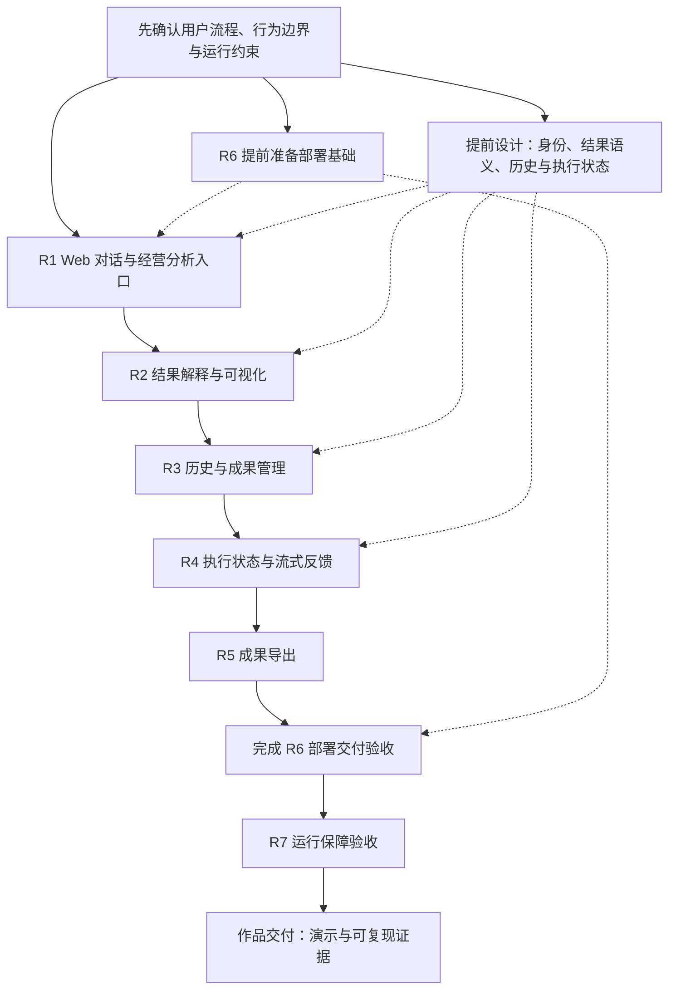

# ChatBI MVP → 生产演进路线

## 当前阶段

ChatBI 的 MVP 核心能力已经形成：自然语言查询、Online Retrieval、Query API、内置身份与 RBAC、多轮查询、经营分析及对应测试 / Evaluation 工具均在当前代码中实现。

生产准备基线已在 clean commit `6a5e6ccc6504ebc0947a6addb4abb02d87b566d3` 核验：正式单轮 29/29、多轮 7/7（15 个轮次）、Business Analysis 10/10，均 `0 FAIL`、`0 INVALID_CASE`，三次独立多轮诊断各 7/7 通过。原始报告保存在本机 ignored 目录 `reports/evaluation/baseline-20261003T6a5e6cc/{formal,diagnostic-1,diagnostic-2,diagnostic-3}`；它们绑定该提交、案例集和运行资源，后续提交不自动继承通过身份，报告也不保证在新 clone 中存在。

产品 V1 的需求方向和优先顺序已确认。R1 / R2 和本地容器开发已交付（PR49 / PR51 / PR50）。R3 历史与成果管理已合并 [PR54](https://github.com/K999999999999/chatbi/pull/54)（2019443），见 [Contract](specs/history-results-v1.md) 和 [Acceptance](acceptance/history-results-v1.md)。R4 六项实现、Review 和本地验收已完成，[PR55](https://github.com/K999999999999/chatbi/pull/55) 已合并（ee92aca），见 [Spec](specs/execution-streaming-v1.md)、[Design](designs/execution-streaming-v1.md) 和 [Acceptance](acceptance/execution-streaming-v1.md)。Evaluation 仍绑定报告候选，不自动迁移到 merge commit。R5 导出的行为、技术与验收已逐项确认，[完整 Spec](specs/result-export-v1.md) 已整体确认，Design Review PASS、四项 Ticket Readiness READY；用户于 2026-10-06 确认拆分并授权连续完成四项本地实施。Ticket 01 XLSX 本地候选 `111980d`、Ticket 02 PNG 本地候选 `88f122c` 均已完成验证和 Code Review；R5 clean candidate `71d72d2` 的本地实现与完整隔离验收通过；Ticket 01–04 完成，[PR56](https://github.com/K999999999999/chatbi/pull/56) 已合并（`367a42a`），required CI 全部通过。生产部署和运行验收仍不属于本次交付。R6 本地首版完整 Spec 已确认、Design Review PASS、四项 Ticket Readiness READY；用户已确认拆分并授权完整本地实施。Ticket 01 固定版本 API/PostgreSQL 镜像已构建并完成定向验收，commit `4d4732b` 及 image ID 记录见 [R6 Ticket 01](../.scratch/r6-local-deployment/issues/01-fixed-release-image.md)；Ticket 02 独立环境与启停已完成，最终clean candidate为`733b074`；Ticket 03兼容升级 / 回滚、真实版本对往返和持久状态核对已完成，候选 C/D 与完整证据见 [Ticket 03](../.scratch/r6-local-deployment/issues/03-compatible-upgrade-rollback.md)。Ticket 04完整Windows业务 / 导出与专用服务恢复验收已完成（clean runtime `2b4a8c8`），见 [R6 Acceptance](acceptance/local-deployment-v1.md)；四项本地实施完成，PR60 已合并（`9a70601`），required CI 与分支清理完成，见 [PR60](https://github.com/K999999999999/chatbi/pull/60)。2026-10-08稳定服务恢复、HTTP和数据指纹核验通过，见 [R6 Acceptance](acceptance/local-deployment-v1.md#稳定服务恢复核验2026-10-08)；电脑 / Docker重启恢复仍待维护窗口验收。R7完整Spec、Design复审和七项拆分已确认；Ticket 01–06本地实现/Review及适用软件与OTLP集成验证完成；Ticket 07 clean候选`59e1e34`的Windows首问、同一对话追问、多指标、PNG/XLSX及经营分析通过，验证了流式包装器修复；PDF API返回200、Edge收到204，当前IDM接管PDF；历史/成果、重启及容量/恢复/云端矩阵仍待验，用户已授权按顺序继续本地处理，整体未完成，见[R7 Acceptance](acceptance/local-operations-v1.md)。

历史完整 Evaluation 基线包括 commit `31a04549924f622777f106d4fe5a758bd2ca2beb` 和较新的 `564343216e4493f832f07efb345c03b058a04eb5`；后者的三套通过证据及此前多轮失败见[工作项验收记录](../.scratch/engineering-quality-gates/issues/04-current-candidate-evaluation-baseline.md#result)。历史通过结果不代表当前 HEAD 或模型稳定性。当前候选只有在三套正式报告均指向同一最终 clean commit、`git_dirty=false` 且各自 `0 FAIL`、`0 INVALID_CASE` 后才能标记为新的正式 AI Evaluation 基线。

2026-10-09 R7 clean candidate `f1b98d7` 复跑的问数与 PNG / XLSX 通过，经营分析重复以 `LLM_ERROR` 失败；最小合成 Provider 流式探针可用。随后获准的隔离诊断捕获 `PROVIDER_STREAM_UNAVAILABLE`，源码定位为 R7 `ObservedModel` 未转发 `stream()`，导致摘要请求未发送到 Provider；修复已提交并构建候选 `515c253`。`515c253` Edge 首条问数未取得成功快照；后续 clean 候选 `2d907c0` 与 `8f73ab1` 的首条问数/SSE/XLSX通过，但追问阶段均未观察到终态响应而超时，经营分析未运行；`8f73ab1`只记录到首问执行详情GET。提交`10a3a17`已补充追问提交计数、响应数、HTTP状态及白名单错误码摘要；用户已要求按顺序继续处理；最新`59e1e34`本轮追问、经营分析和PNG/XLSX成功，分析修复得到实际验证，流程在PDF客户端204处停止。Ticket 07仍未完成。稳定环境曾停止，已按原 R6 发布恢复并核验，原因未确认。详细证据见 [R7 Acceptance](acceptance/local-operations-v1.md) 和 [R6 稳定服务重启核验](acceptance/local-deployment-v1.md#稳定服务重启核验2026-10-09)。

2026-10-09 后续隔离候选 `7c12c1e` 首条提交收到 `503 / SERVICE_NOT_READY`，未进入执行；已补专属 `/ready` 验收前置等待，尚待新候选真实运行。用户提供并确认了阿里云 OTLP 配置，固定 Header 适配 `e1801a5` 的确定性验证通过，配置仅保存于私有本地文件；云端可查询性与 R7 完整验收仍未通过，实际 stable 未切换。

后续 `a01545f` 隔离运行通过首次就绪及首问，追问收到明确就绪拒绝；完整验收未通过。真实探针诊断确认重复导入耗时问题，正在按已授权范围修复并复验；独立阿里云合成连接探针导出成功，但云端可查询性与业务完整链路仍未确认，R7状态仍未完成。

## 路线顺序与优先级状态

三套验收入口、报告身份检查及基线核验已经完成。用户于 2026-10-03 确认产品 V1 目标，并在项目审查后授权按建议修订需求与优先级：先明确用户流程与运行约束，再推进对话和分析入口、结果可视化、历史与成果、流式和导出，最后完成部署运行验收及作品交付。部署基础与跨需求状态设计提前准备，验证贯穿各项交付。

用户于 2026-10-03 确认先在 R2 前准备本地容器开发：Compose 统一启动前后端与基础设施、源码挂载和热更新、仅本机访问、CPU Embedding，并保留显式初始化与持久数据。[开发环境 Spec](../.scratch/container-dev-environment/spec.md) 已确认，Design Review PASS，[三项 Ticket 草案](../.scratch/container-dev-environment/tickets-draft.md)通过 Readiness，三项拆分与整体本地实施已授权；三项本地实施与clean candidate验收通过（[证据](acceptance/container-dev-environment-20261003.md)），PR50 已合并（f182cf3）；此项不代表 R6 正式生产镜像、部署或运行验收完成。R1–R4 已交付（PR49 / PR51 / PR54 / PR55）。R5 完整 Spec 确认、Design Review 与草案 Readiness 已完成；用户已确认四项拆分和整体本地实施，Ticket 01 XLSX 本地候选 `111980d`、Ticket 02 PNG 本地候选 `88f122c` 已完成验证与 Review，R5 clean candidate `71d72d2` 的本地实现与完整隔离验收通过；Ticket 01–04 完成，PR56 已合并（`367a42a`），required CI 全部通过；未包含生产部署或目标环境验收。

此优先级是分阶段交付顺序，不要求一次实现全部目标。具体技术选择、容量等指标和 Ticket 直接依赖待相应 Spec / Design 确认；检索优化和额外产品扩展不因旧文档将其列为“后续”而成为已授权目标。

路线图按已确认目标和可核验证据维护；状态变化与优先级决定分别记录。读取时机、更新触发条件及用户确认边界见 [Harness 路线图维护规则](agents/agent-harness.md#路线图读取与维护)。

## 已确认的产品 V1 目标与路线

目标：面向销售经营分析的完整 AI 数据产品作品，用户通过对话获得可信的数据、图表和分析报告；开发者能够独立部署、维护并核验正确性与运行能力。

第一版聚焦销售领域与单一 PostgreSQL 数据源，以 SQLBot 的交互和产品完整度为参照。目标能力包含独立 Web 前端、连续对话、图表、流式反馈、历史记录、成果保存与导出，以及部署和运行证据。已确认目标、候选验收场景及未决问题见[产品 V1 工作记录](../.scratch/chatbi-product-v1/spec.md)。

| 阶段 | 目标 | 状态 |
| --- | --- | --- |
| 1. 目标细化 | 明确用户、核心流程、支持边界和验收标准；提前澄清部署、身份、结果语义、历史与执行状态 | R1–R5 Spec 已确认；R5 Design Review PASS、四项 Ticket Readiness READY；R6完整Spec与四项Ticket拆分、整体实施范围已确认，Design PASS / Readiness READY；R7完整Spec已确认，Design Review PASS，七项草案Readiness READY，七项拆分与整体本地实施已授权，01–06本地实现/Review及适用软件与OTLP集成验证完成；Ticket 07 clean候选`59e1e34`的Windows首问、同一对话追问、多指标、PNG/XLSX及经营分析通过，验证了流式包装器修复；PDF API返回200、Edge收到204，当前IDM接管PDF；历史/成果、重启及容量/恢复/云端矩阵仍待验，用户已授权按顺序继续本地处理，整体未完成，见[R7 Acceptance](acceptance/local-operations-v1.md) |
| 2. 用户闭环 | 按 R1 → R2 → R3 → R4 → R5 推进；部署基础 R6 在目标环境确定后提前准备 | R1–R4 已交付；R5 Ticket 01 XLSX 候选 `111980d`、Ticket 02 PNG 候选 `88f122c` 已完成，R5 clean candidate `71d72d2` 的本地实现与完整隔离验收通过；Ticket 01–04 完成，PR56 已合并（`367a42a`） |
| 3. 生产准备 | 完成 R6 的部署交付验收及 R7 的安全、监控、容量与恢复验收 | R6 Ticket 01 / 02 / 03完成；Ticket 04本地完整入口验收通过（runtime `2b4a8c8`），PR60 已合并（`9a70601`），required CI 与分支清理完成，见 [PR60](https://github.com/K999999999999/chatbi/pull/60)；电脑 / Docker重启待维护窗口；R7运行Contract与指标已确认，设计与Ticket就绪，整体本地实施已授权，01–06本地实现/Review及适用软件与OTLP集成验证完成；Ticket 07 clean候选`59e1e34`的Windows首问、同一对话追问、多指标、PNG/XLSX及经营分析通过，验证了流式包装器修复；PDF API返回200、Edge收到204，当前IDM接管PDF；历史/成果、重启及容量/恢复/云端矩阵仍待验，用户已授权按顺序继续本地处理，整体未完成，见[R7 Acceptance](acceptance/local-operations-v1.md) |
| 4. 作品交付 | 演示、架构说明及可复现评测和运行证据 | 阶段目标已确认，交付验收待细化 |

### 路线优先级图

主链实线表示已确认的交付优先顺序，虚线表示提前准备的设计或运行约束，不是已确认的 Ticket 阻塞关系。R6 是同一需求的基础准备与最终验收，不重复建设或分别宣称完成。各项均需完成适用验证；具体直接依赖在设计与 Ticket 拆分时核实。

### 需求范围与验收方向

以下是需求规划单元，不是正式 Tickets；每项细化后单独形成行为 Spec 和可验收切片。

| ID | 需求 | 交付范围与验收方向 | 当前状态 |
| --- | --- | --- | --- |
| R1 | Web 对话与经营分析入口 | 仅电脑端；React + TypeScript + Vite，复用 FastAPI。登录 / 首次改密、问数 / 追问、澄清 / 拒绝及独立分析模式；Cookie 登录兼容 Bearer，验收后移除 Streamlit。R1 阶段刷新回到空白新对话；长期历史与快照恢复由 R3 提供 | Spec 已确认，设计 / Readiness 通过，五项 Ticket 已完成；Streamlit 已移除，最终代码候选本地验收通过；PR49 已合并（8c506fa） |
| R2 | 结果解释与可视化 | 图表与表格默认同显、可分别收起；可信列类型 / 指标 / 单位 / 查询范围、统一数字格式、产品及因素贡献证据；空值 / 截断 / 语义不明安全降级 | 完整Spec已确认，Design Review PASS，四项草案Readiness READY；四项本地实施与clean验收完成（[证据](acceptance/result-visualization-v1-20261004.md)），PR51 已合并（1f57c9b），交付记录见 [PR51](https://github.com/K999999999999/chatbi/pull/51) |
| R3 | 历史与成果管理 | 私人历史、快照重开、完整条件续聊、显式重查、独立成果与删除；检查当前身份及权限 | 六项实现与本地验收已完成；PR54 已合并（2019443）；见 [Acceptance](acceptance/history-results-v1.md) |
| R4 | 执行状态与流式反馈 | 后台受理与幂等、真实执行阶段、SSE 观察与恢复、取消 / 超时 / 授权停止、报告草稿与正式结果门槛 | 六项实现与本地验收已完成；PR55 已合并（ee92aca）；见 [Acceptance](acceptance/execution-streaming-v1.md)，不代表生产部署 |
| R5 | 成果导出 | 成功快照导出 XLSX / PNG / PDF；保留精度、口径、截断与证据；不重查或获取全量数据，最多 100 行；当前身份 / owner / 权限检查；每账号 1 / API 2 个并发、60 秒、20 MiB | 需求逐项确认；[完整 Spec](specs/result-export-v1.md) 已整体确认，四项拆分与整体本地实施已授权；Ticket 01 XLSX 候选 `111980d`、Ticket 02 PNG 候选 `88f122c` 已完成，R5 clean candidate `71d72d2` 本地实现与完整隔离验收通过；Ticket 01–04 完成；[PR56](https://github.com/K999999999999/chatbi/pull/56) 已合并（`367a42a`），required CI 全部通过；生产部署和目标环境验收未包含 |
| R6 | 部署交付 | 当前 Windows + WSL2 + Docker 电脑上的固定版本应用；销售合成数据；隔离配置与持久资源；显式初始化和手动启停；短暂停机升级与兼容回滚、真实浏览器验收 | [完整 Spec](../.scratch/r6-local-deployment/spec.md)、[整体实施范围与四项拆分](../.scratch/r6-local-deployment/tickets-draft.md)已确认；Design Review PASS、Ticket Readiness READY。Ticket 01镜像已完成并绑定clean commit `4d4732b` 与image ID；Ticket 02独立环境与启停完成（clean candidate `733b074`）；Ticket 03兼容升级 / 回滚与持久状态验收完成（clean candidates `9ae32ef` / `995440b`）；Ticket 04完整Windows业务 / 导出 / 专用服务恢复已验收（runtime `2b4a8c8`），见 [Acceptance](acceptance/local-deployment-v1.md)；交付完成，PR60 已合并（`9a70601`），required CI 与分支清理完成，见 [PR60](https://github.com/K999999999999/chatbi/pull/60)，电脑 / Docker重启待维护窗口。PR50仍仅代表开发环境，R6本地验收证据独立记录；公网部署和金丝雀发布不在首版范围 |
| R7 | 运行保障 | 动态 readiness、并发与资源限制、监控告警、备份恢复及容量证据；按目标确定延迟、恢复和访问规模要求 | [完整Spec](../.scratch/local-operations-v1/spec.md)已确认，[Design复审](../.scratch/local-operations-v1/design-review-2.md)PASS，[七项草案](../.scratch/local-operations-v1/tickets-draft.md)Readiness READY；七项拆分与整体本地实施已授权，Ticket 01–06本地实现/Review完成；Ticket 07 clean候选`59e1e34`的Windows首问、同一对话追问、多指标、PNG/XLSX及经营分析通过，验证了流式包装器修复；PDF API返回200、Edge收到204，当前IDM接管PDF；历史/成果、重启及容量/恢复/云端矩阵仍待验，用户已授权按顺序继续本地处理，整体未完成，见[R7 Acceptance](acceptance/local-operations-v1.md) |

### 跨需求设计与验证要求

- 普通多轮查询与经营分析当前使用独立状态。R1 必须明确入口与切换行为；不默认自动路由或继承查询条件。经营分析继续遵守两个时期、人民币净销售额 / 毛利及产品因素归因范围；扩展分析行为需要单独确认。
- 短期多轮状态、分析 checkpoint 和长期历史分别定义生命周期。当前多轮状态为进程内 30 分钟 Idle TTL，checkpoint 为 24 小时恢复期限；R3 不直接延长现有 TTL 来替代历史，R4 不把 checkpoint 当作完整执行状态 Contract。
- R4 Contract 见正式 [Spec](specs/execution-streaming-v1.md)：只显示真实执行阶段；草稿未校验，最终报告须通过适用校验。结果有效后展示表格 / 图表，SQL 校验完成后提供查看入口。六项实现和验收完成、PR55 已合并；见 [Acceptance](acceptance/execution-streaming-v1.md)，Evaluation 仍绑定原报告候选。
- 原初始场景为单台 Linux / 云服务器；用户于 2026-10-07 确认 R6 首版改为当前 Windows + WSL2 + Docker 电脑，指定账号仅本机同源 HTTP 访问，保留 Cookie 登录与 CSRF 防护；暂不需要公网 / 局域网访问。后续线上访问仍要求 HTTPS，不属于本地首版验收。所有有查询权限的指定用户共享同一套业务数据，历史按账号隔离；首版不新增区域 / 部门行列隔离。多 worker / 多副本的会话可见性未获承诺；流式、历史、并发与执行状态的关键 Contract 在相关实现前确定。
- 每项需求交付同步完成适用 Software Test、浏览器验收、AI Evaluation 或运行验收。已有进程内多轮评测不覆盖真实浏览器登录、刷新、流式网络连接和长期历史；相应链路须新增验收证据。
- 作品交付汇总各阶段证据，并提供可复现入口；原始本机报告不是新 clone 自动具备的证据。报告继续绑定提交、案例集和运行资源，不将历史通过结果改称新候选已通过。

### 后续按需求评估的扩展

多数据库、多 Schema、多租户、仪表板编辑器、任意复杂 Agent、SQL 自动修复和 MCP 集成不作为产品 V1 的默认实施项。细粒度数据权限是否进入第一版，取决于确认的用户与数据范围；不能把固定 RBAC 宣称为行列级隔离。

此处确认目标和阶段路线，不代表自动获得其他功能的实施授权。R1–R4 已按各自授权交付。R5 完整 Spec、Design Review 和 Ticket Readiness 已完成；用户于 2026-10-06 确认四项拆分及整体本地实施，Ticket 01 XLSX 候选 `111980d`、Ticket 02 PNG 候选 `88f122c` 已完成，R5 clean candidate `71d72d2` 的本地实现与完整隔离验收通过；Ticket 01–04 完成，PR56 已合并（`367a42a`），required CI 全部通过；未包含生产部署。R6完整Spec、Design Review、四项Ticket Readiness、拆分与完整本地实施授权均已完成；Ticket 01镜像与Ticket 02独立运行验收完成，Ticket 02最终候选为clean commit `733b074`；Ticket 03版本兼容升级 / 回滚、真实版本对往返和持久状态核对已完成，Ticket 04本地完整入口验收通过（runtime `2b4a8c8`），PR60 已合并（`9a70601`），required CI 与分支清理完成，见 [PR60](https://github.com/K999999999999/chatbi/pull/60)；电脑 / Docker重启待维护窗口，用户于2026-10-08明确授权本目标远端发布，合并与CI事实见 [PR60](https://github.com/K999999999999/chatbi/pull/60)。R7完整Spec已确认，Design复审PASS，七项草案Readiness READY；七项拆分与整体本地实施已授权，Ticket 01–06本地实现/Review与适用软件/OTLP集成验证完成；Ticket 07 clean候选`59e1e34`的Windows首问、同一对话追问、多指标、PNG/XLSX及经营分析通过，验证了流式包装器修复；PDF API返回200、Edge收到204，当前IDM接管PDF；历史/成果、重启及容量/恢复/云端矩阵仍待验，用户已授权按顺序继续本地处理，整体未完成，见[R7 Acceptance](acceptance/local-operations-v1.md)。

## 基线工作与适用证据

- [x] RAG manifest 记录 Structure Metadata、Metrics 和 Embedding 配置来源指纹。
- [x] production Ready 校验当前 PostgreSQL catalog、结构 metadata 与发布资产；无法验证或不一致时拒绝服务。
- [x] clean bootstrap 安装 Control DB migration、LangGraph checkpoint 表与权限；缺少关键对象时 healthcheck 失败。
- [x] Runbook 描述从新环境初始化到服务运行的步骤。
- [x] 运行资源装配、启动检查、失败清理和关闭集中到 `src/bootstrap/`；四类初始化命令统一入口，旧入口已移除。行为与验收边界见 [初始化 Spec](specs/bootstrap.md)。
- [x] 在 clean commit `6a5e6cc` 完成 29 个单轮、7 个多轮、10 个 Business Analysis 案例的正式 Evaluation；各必需套件 `0 FAIL`、`0 INVALID_CASE`。后续候选按 Evaluation Contract 判断复用与重跑要求。
- [x] `6a5e6cc` 报告记录同一 commit、`git_dirty=false`、案例集及资源身份，统一身份验收通过；报告在上述本机 ignored 目录保留。
- [x] 正式三套统一验收入口和手动 Real E2E 实现已补齐，自动检查 clean commit、案例 / 轮次完整性、案例集 Hash、RAG / 数据与模型身份；软件验证通过，真实外部工作流运行仍需独立核验。
- [x] 在 `6a5e6cc` 正式基线之外保存三次完整多轮诊断，各 7/7 通过；此前失败证据保留，`MT-FAILURE-ISOLATION` 历史模型波动仍按报告解释。诊断不替换失败的正式报告，也不改变现有零失败验收门槛。

## 当前 MVP 能力边界

- 单一 PostgreSQL `mart_sales` 数据源；没有多 Schema、多租户或多数据源 Contract。
- 在线多指标查询最多支持 5 个指标，Join 只使用可认证的直接 FK→PK 关系。
- Business Analysis 受当前已登记的指标和分析范围约束。
- 电脑端 React / TypeScript / Vite 已通过 R4 后台 execution 与 SSE 提供真实状态、断连恢复、取消和报告草稿；同步 Query API 保留兼容。R2 可视化、R3 私人历史与成果继续适用，见 [R2 Spec](specs/result-visualization-v1.md)、[R3 Spec](specs/history-results-v1.md)、[R4 Spec](specs/execution-streaming-v1.md)。R3 / R4 已合并；R5 Ticket 01 XLSX 候选 `111980d`、Ticket 02 PNG 候选 `88f122c` 均已通过验证与 Review；R5 clean candidate `71d72d2` 本地实现与完整隔离验收通过；Ticket 01–04 完成，PR56 已合并（`367a42a`），required CI 全部通过；未部署到生产环境。

## 后续生产工作

R6 本地首版目标和验收已逐项确认，见[已确认完整 Spec](../.scratch/r6-local-deployment/spec.md)：本机固定版本构建、隔离环境、显式初始化、手动后台启停、长期数据保留与兼容回滚。它不等于云部署或生产运行就绪；R7 的完整 Spec、Design Review 和验收指标已确认；Ticket 01–06本地实现/Review已完成；Ticket 07 clean候选`59e1e34`的Windows首问、同一对话追问、多指标、PNG/XLSX及经营分析通过，验证了流式包装器修复；PDF API返回200、Edge收到204，当前IDM接管PDF；历史/成果、重启及容量/恢复/云端矩阵仍待验，用户已授权按顺序继续本地处理，整体未完成，见[R7 Acceptance](acceptance/local-operations-v1.md)。

R6 / R7 设计需显式处理以下现有运行边界；需求层交付顺序已确认，具体方案、指标及需求内顺序待确认：

- 多轮会话保存在进程内；多 worker / 多副本之间不共享会话，必须定义请求路由与会话可见性策略，不能直接增加 worker 后宣称多轮能力可用。
- `/health` 只反映启动后 HTTP 存活，不检测下游实时状态；需定义 liveness、动态 readiness、依赖故障与恢复验收。
- 已有 SQL 超时与结果行数上限，但没有 API 限流；需根据目标流量明确并发 / 资源限制、容量与延迟要求，不预先指定网关、连接池或共享存储产品。

## 事实源

- 产品行为和支持范围：[`product-scope.md`](product-scope.md) 与 `docs/specs/`。
- 架构边界：[`architecture.md`](architecture.md)。
- 可执行初始化和维护流程：[`runbook.md`](runbook.md)。
- 当前 Evaluation 结果：带有当前 commit 身份的报告；日期化 `docs/acceptance/` 与旧 reports 是历史证据。
