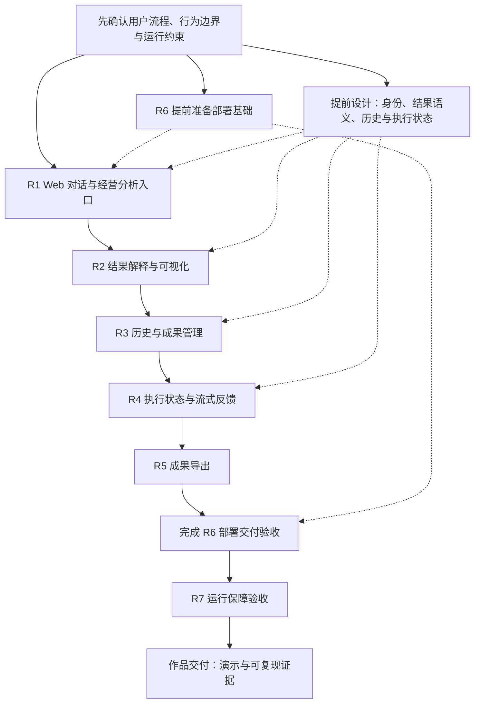

# ChatBI MVP → 生产演进路线

## 当前阶段

ChatBI 的 MVP 核心能力已经形成：自然语言查询、Online Retrieval、Query API、内置身份与 RBAC、多轮查询、经营分析及对应测试 / Evaluation 工具均在当前代码中实现。

生产准备基线已在 clean commit `6a5e6ccc6504ebc0947a6addb4abb02d87b566d3` 核验：正式单轮 29/29、多轮 7/7（15 个轮次）、Business Analysis 10/10，均 `0 FAIL`、`0 INVALID_CASE`，三次独立多轮诊断各 7/7 通过。原始报告保存在本机 ignored 目录 `reports/evaluation/baseline-20261003T6a5e6cc/{formal,diagnostic-1,diagnostic-2,diagnostic-3}`；它们绑定该提交、案例集和运行资源，后续提交不自动继承通过身份，报告也不保证在新 clone 中存在。

产品 V1 的需求方向和优先顺序已确认。[R1 完整 Spec](../.scratch/chatbi-product-v1/r1-spec.md) 已获用户整体确认，设计审查与 Ticket Readiness 已通过，[五项实施拆分](../.scratch/chatbi-product-v1/r1-tickets-draft.md)和整体实施范围已获确认；R1 电脑端入口、旧入口移除和本地验收已完成（[证据](acceptance/web-dialogue-v1-20261003.md)），PR49 已合并（8c506fa）；R2 [完整 Spec](../.scratch/result-visualization-v1/spec.md) 已确认，Design Review PASS，四项草案 Readiness READY，四项本地实施与最终clean代码候选验收已完成（[证据](acceptance/result-visualization-v1-20261004.md)），PR51 已合并（1f57c9b），交付记录见 [PR51](https://github.com/K999999999999/chatbi/pull/51)；R3 历史与成果管理的完整 Spec、恢复方向、最终 Design Review、六项 Readiness 和整体本地实施授权均已确认，六项实现与本地检查已完成。R3 当前候选、真实验收与 Evaluation 的身份和结果记录在 Git 公共目录的本机实时工作状态；见 [R3 Contract](specs/history-results-v1.md) 和 [验收入口](acceptance/history-results-v1.md)。R4 正式 [Spec](specs/execution-streaming-v1.md) 与 [Design](designs/execution-streaming-v1.md) 已确认，Design Review PASS、六项 Ticket Readiness READY，拆分与整体本地实施已获确认；Ticket 01–05 已完成本地实现与适用验证，Ticket 04 状态 / 结果真实验收和 Ticket 05 实际模型文字增量开发证据见 [R4 Acceptance](acceptance/execution-streaming-v1.md)。Ticket 06 的最终 clean 候选、三套正式 Evaluation 与真实门禁结果记录在本机 Git 公共目录实时状态；该状态不授权远端发布。R5–R7 的具体行为、技术与验收指标仍待细化。生产部署、容量验证和生产运行保障仍未完成。

历史完整 Evaluation 基线包括 commit `31a04549924f622777f106d4fe5a758bd2ca2beb` 和较新的 `564343216e4493f832f07efb345c03b058a04eb5`；后者的三套通过证据及此前多轮失败见[工作项验收记录](../.scratch/engineering-quality-gates/issues/04-current-candidate-evaluation-baseline.md#result)。历史通过结果不代表当前 HEAD 或模型稳定性。当前候选只有在三套正式报告均指向同一最终 clean commit、`git_dirty=false` 且各自 `0 FAIL`、`0 INVALID_CASE` 后才能标记为已核验。

## 路线顺序与优先级状态

三套验收入口、报告身份检查及基线核验已经完成。用户于 2026-10-03 确认产品 V1 目标，并在项目审查后授权按建议修订需求与优先级：先明确用户流程与运行约束，再推进对话和分析入口、结果可视化、历史与成果、流式和导出，最后完成部署运行验收及作品交付。部署基础与跨需求状态设计提前准备，验证贯穿各项交付。

用户于 2026-10-03 确认先在 R2 前准备本地容器开发：Compose 统一启动前后端与基础设施、源码挂载和热更新、仅本机访问、CPU Embedding，并保留显式初始化与持久数据。[开发环境 Spec](../.scratch/container-dev-environment/spec.md) 已确认，Design Review PASS，[三项 Ticket 草案](../.scratch/container-dev-environment/tickets-draft.md)通过 Readiness，三项拆分与整体本地实施已授权；三项本地实施与clean candidate验收通过（[证据](acceptance/container-dev-environment-20261003.md)），PR50 已合并（f182cf3）；此项不代表 R6 正式生产镜像、部署或运行验收完成。R2结果解释与可视化四项本地实施及clean候选验收已完成，PR51 已合并（1f57c9b），交付记录见 [PR51](https://github.com/K999999999999/chatbi/pull/51)；R3 完整 Spec、设计与恢复语义、最终 Design Review、六项 Ticket Readiness 及整体本地实施授权已完成；六项实现和适用本地检查已完成，当前候选身份与验收结果见本机实时工作状态。R4 正式 Spec / Design、Design Review 与六项 Readiness 已完成，整体本地实施已获确认；Ticket 01–05 完成及分阶段验收证据见 [R4 Acceptance](acceptance/execution-streaming-v1.md)，Ticket 06 最终候选和整体验收状态见本机 Git 公共目录实时记录。

此优先级是分阶段交付顺序，不要求一次实现全部目标。具体技术选择、容量等指标和 Ticket 直接依赖待相应 Spec / Design 确认；检索优化和额外产品扩展不因旧文档将其列为“后续”而成为已授权目标。

路线图按已确认目标和可核验证据维护；状态变化与优先级决定分别记录。读取时机、更新触发条件及用户确认边界见 [Harness 路线图维护规则](agents/agent-harness.md#路线图读取与维护)。

## 已确认的产品 V1 目标与路线

目标：面向销售经营分析的完整 AI 数据产品作品，用户通过对话获得可信的数据、图表和分析报告；开发者能够独立部署、维护并核验正确性与运行能力。

第一版聚焦销售领域与单一 PostgreSQL 数据源，以 SQLBot 的交互和产品完整度为参照。目标能力包含独立 Web 前端、连续对话、图表、流式反馈、历史记录、成果保存与导出，以及部署和运行证据。已确认目标、候选验收场景及未决问题见[产品 V1 工作记录](../.scratch/chatbi-product-v1/spec.md)。

| 阶段 | 目标 | 状态 |
| --- | --- | --- |
| 1. 目标细化 | 明确用户、核心流程、支持边界和验收标准；提前澄清部署、身份、结果语义、历史与执行状态 | R1 / R2 已交付；R3 完整 Spec / 恢复语义、设计审查与六项 Readiness 已完成，六项实现 / 本地验证已完成；候选验收状态见本机实时工作状态；R4 正式 Spec / Design / Readiness 已完成，Ticket 01–05 本地实现及分阶段证据见 R4 Acceptance，Ticket 06 最终 clean 候选状态与三套正式 Evaluation 身份见本机实时工作状态；R5–R7 待细化 |
| 2. 用户闭环 | 按 R1 → R2 → R3 → R4 → R5 推进；部署基础 R6 在目标环境确定后提前准备 | R1 / R2 已交付（PR49 / PR51）；R3 六项实现已完成，最终候选与验收身份见本机实时工作状态；R4 本地实现及各阶段证据见 [Acceptance](acceptance/execution-streaming-v1.md)，Ticket 06 最终候选与 Evaluation 结论见本机实时工作状态；R5 待细化 |
| 3. 生产准备 | 完成 R6 的部署交付验收及 R7 的安全、监控、容量与恢复验收 | 方向已确认，具体运行 Contract 与指标待确认 |
| 4. 作品交付 | 演示、架构说明及可复现评测和运行证据 | 阶段目标已确认，交付验收待细化 |

### 路线优先级图

主链实线表示已确认的交付优先顺序，虚线表示提前准备的设计或运行约束，不是已确认的 Ticket 阻塞关系。R6 是同一需求的基础准备与最终验收，不重复建设或分别宣称完成。各项均需完成适用验证；具体直接依赖在设计与 Ticket 拆分时核实。

### 需求范围与验收方向

以下是需求规划单元，不是正式 Tickets；每项细化后单独形成行为 Spec 和可验收切片。

| ID | 需求 | 交付范围与验收方向 | 当前状态 |
| --- | --- | --- | --- |
| R1 | Web 对话与经营分析入口 | 仅电脑端；React + TypeScript + Vite，复用 FastAPI。登录 / 首次改密、问数 / 追问、澄清 / 拒绝及独立分析模式；Cookie 登录兼容 Bearer，验收后移除 Streamlit。R1 阶段刷新回到空白新对话；长期历史与快照恢复由 R3 提供 | Spec 已确认，设计 / Readiness 通过，五项 Ticket 已完成；Streamlit 已移除，最终代码候选本地验收通过；PR49 已合并（8c506fa） |
| R2 | 结果解释与可视化 | 图表与表格默认同显、可分别收起；可信列类型 / 指标 / 单位 / 查询范围、统一数字格式、产品及因素贡献证据；空值 / 截断 / 语义不明安全降级 | 完整Spec已确认，Design Review PASS，四项草案Readiness READY；四项本地实施与clean验收完成（[证据](acceptance/result-visualization-v1-20261004.md)），PR51 已合并（1f57c9b），交付记录见 [PR51](https://github.com/K999999999999/chatbi/pull/51) |
| R3 | 历史与成果管理 | 历史列表、重新打开、保存查询 / 报告和删除；定义结果快照与重新查询、历史重开与继续追问、保留期限；读取历史仍检查当前身份和权限 | 完整 Spec、恢复语义与实施设计已确认，Design Review PASS，六项 Ticket Readiness READY；六项本地实现 / 检查已完成，当前候选真实验收与 Evaluation 状态见本机实时工作状态 |
| R4 | 执行状态与流式反馈 | 后台受理与幂等、真实执行阶段、SSE 观察与恢复、取消 / 超时 / 授权停止、报告未校验文字草稿与正式结果门槛 | Spec / Design 已确认，Design Review PASS，六项 Readiness READY，整体本地实施已获授权；分阶段实现与真实证据见 [Acceptance](acceptance/execution-streaming-v1.md)，最终 clean 候选、三套 Evaluation 和门禁状态见本机实时工作状态；远端发布未授权 |
| R5 | 成果导出 | 明确当前查询数据、图表或报告的导出格式、数据范围和授权；当前查询最多返回 100 行，完整数据导出需要独立确认资源限制与验收 | 待澄清 |
| R6 | 部署交付 | 提前确定目标环境、浏览器访问与身份方式、配置和初始化；交付完整应用打包、升级 / 回滚流程，并在目标环境验收 | 正式部署待澄清；R2 前本地容器开发 Spec 已确认，设计 / Readiness 与拆分已确认；本地容器开发已通过clean candidate验收，PR50已合并 |
| R7 | 运行保障 | 动态 readiness、并发与资源限制、监控告警、备份恢复及容量证据；按目标确定延迟、恢复和访问规模要求 | 待澄清 |

### 跨需求设计与验证要求

- 普通多轮查询与经营分析当前使用独立状态。R1 必须明确入口与切换行为；不默认自动路由或继承查询条件。经营分析继续遵守两个时期、人民币净销售额 / 毛利及产品因素归因范围；扩展分析行为需要单独确认。
- 短期多轮状态、分析 checkpoint 和长期历史分别定义生命周期。当前多轮状态为进程内 30 分钟 Idle TTL，checkpoint 为 24 小时恢复期限；R3 不直接延长现有 TTL 来替代历史，R4 不把 checkpoint 当作完整执行状态 Contract。
- R4 Contract 见正式 [Spec](specs/execution-streaming-v1.md)：只显示真实执行阶段；报告生成中的文字标记未校验，最终报告须通过适用校验。查询成功且结果有效后展示表格 / 图表，SQL 校验完成后提供查看入口。Ticket 04 状态 / 结果与 Ticket 05 真实模型文字增量证据已记录；最终 clean 候选各门禁和三套 Evaluation 以本机实时状态为准。
- 已确认初始场景为单台 Linux / 云服务器供指定账号使用，同时支持本地开发；同源网页 / API、Cookie 登录、线上 HTTPS 和 CSRF 防护。所有有查询权限的指定用户共享同一套业务数据，历史按账号隔离；首版不新增区域 / 部门行列隔离。多 worker / 多副本的会话可见性未获承诺；流式、历史、并发与执行状态的关键 Contract 在相关实现前确定。
- 每项需求交付同步完成适用 Software Test、浏览器验收、AI Evaluation 或运行验收。已有进程内多轮评测不覆盖真实浏览器登录、刷新、流式网络连接和长期历史；相应链路须新增验收证据。
- 作品交付汇总各阶段证据，并提供可复现入口；原始本机报告不是新 clone 自动具备的证据。报告继续绑定提交、案例集和运行资源，不将历史通过结果改称新候选已通过。

### 后续按需求评估的扩展

多数据库、多 Schema、多租户、仪表板编辑器、任意复杂 Agent、SQL 自动修复和 MCP 集成不作为产品 V1 的默认实施项。细粒度数据权限是否进入第一版，取决于确认的用户与数据范围；不能把固定 RBAC 宣称为行列级隔离。

此处确认目标和阶段路线，不代表自动获得功能实施授权。R4 已按仓库流程完成澄清、Spec 确认、设计审查及 Ticket 拆分，并获整体本地实施授权；其他目标仍按相同门禁处理。当前 MVP 的公共 Contract 以产品范围和正式 Spec 为准。

## 基线工作与适用证据

- [x] RAG manifest 记录 Structure Metadata、Metrics 和 Embedding 配置来源指纹。
- [x] production Ready 校验当前 PostgreSQL catalog、结构 metadata 与发布资产；无法验证或不一致时拒绝服务。
- [x] clean bootstrap 安装 Control DB migration、LangGraph checkpoint 表与权限；缺少关键对象时 healthcheck 失败。
- [x] Runbook 描述从新环境初始化到服务运行的步骤。
- [x] 运行资源装配、启动检查、失败清理和关闭集中到 `src/bootstrap/`；四类初始化命令统一入口，旧入口已移除。行为与验收边界见 [初始化 Spec](specs/bootstrap.md)。
- [x] 在 clean commit `6a5e6cc` 完成 29 个单轮、7 个多轮、10 个 Business Analysis 案例的正式 Evaluation；各必需套件 `0 FAIL`、`0 INVALID_CASE`。后续候选按 Evaluation Contract 判断复用与重跑要求。
- [x] `6a5e6cc` 报告记录同一 commit、`git_dirty=false`、案例集及资源身份，统一身份验收通过；报告在上述本机 ignored 目录保留。
- [x] 正式三套统一验收入口和手动 Real E2E 实现已补齐，自动检查 clean commit、案例 / 轮次完整性、案例集 Hash、RAG / 数据与模型身份；软件验证通过，真实外部工作流运行仍需独立核验。
- [x] 在 `6a5e6cc` 正式基线之外保存三次完整多轮诊断，各 7/7 通过；此前失败证据保留，`MT-FAILURE-ISOLATION` 历史模型波动仍按报告解释。诊断不替换失败的正式报告，也不改变现有零失败验收门槛。

## 当前 MVP 能力边界

- 单一 PostgreSQL `mart_sales` 数据源；没有多 Schema、多租户或多数据源 Contract。
- 在线多指标查询最多支持 5 个指标，Join 只使用可认证的直接 FK→PK 关系。
- Business Analysis 受当前已登记的指标和分析范围约束。
- 电脑端 React / TypeScript / Vite 使用 R4 后台 execution 与 SSE 获得真实阶段状态、断连恢复、取消和分析报告生成草稿；同步 Query API 仍保留兼容入口。R2 可信结果说明、问数图表与经营分析贡献图，以及 R3 私人历史、快照恢复和独立成果继续适用；详细边界见 [R2 Spec](specs/result-visualization-v1.md)、[R3 Spec](specs/history-results-v1.md) 与 [R4 Spec](specs/execution-streaming-v1.md)。R4 最终候选和真实验收身份见 [Acceptance](acceptance/execution-streaming-v1.md) 及本机实时状态；R5 导出仍属后续需求。

## 后续生产工作

在明确目标运行环境和业务要求后，再为生产部署、Secret 注入、可用性 / 容量、备份恢复、监控告警、发布和回滚设计独立 Contract 与验收。此路线图不预先承诺具体平台或实现方案。

R6 / R7 设计需显式处理以下现有运行边界；需求层交付顺序已确认，具体方案、指标及需求内顺序待确认：

- 多轮会话保存在进程内；多 worker / 多副本之间不共享会话，必须定义请求路由与会话可见性策略，不能直接增加 worker 后宣称多轮能力可用。
- `/health` 只反映启动后 HTTP 存活，不检测下游实时状态；需定义 liveness、动态 readiness、依赖故障与恢复验收。
- 已有 SQL 超时与结果行数上限，但没有 API 限流；需根据目标流量明确并发 / 资源限制、容量与延迟要求，不预先指定网关、连接池或共享存储产品。

## 事实源

- 产品行为和支持范围：[`product-scope.md`](product-scope.md) 与 `docs/specs/`。
- 架构边界：[`architecture.md`](architecture.md)。
- 可执行初始化和维护流程：[`runbook.md`](runbook.md)。
- 当前 Evaluation 结果：带有当前 commit 身份的报告；日期化 `docs/acceptance/` 与旧 reports 是历史证据。
